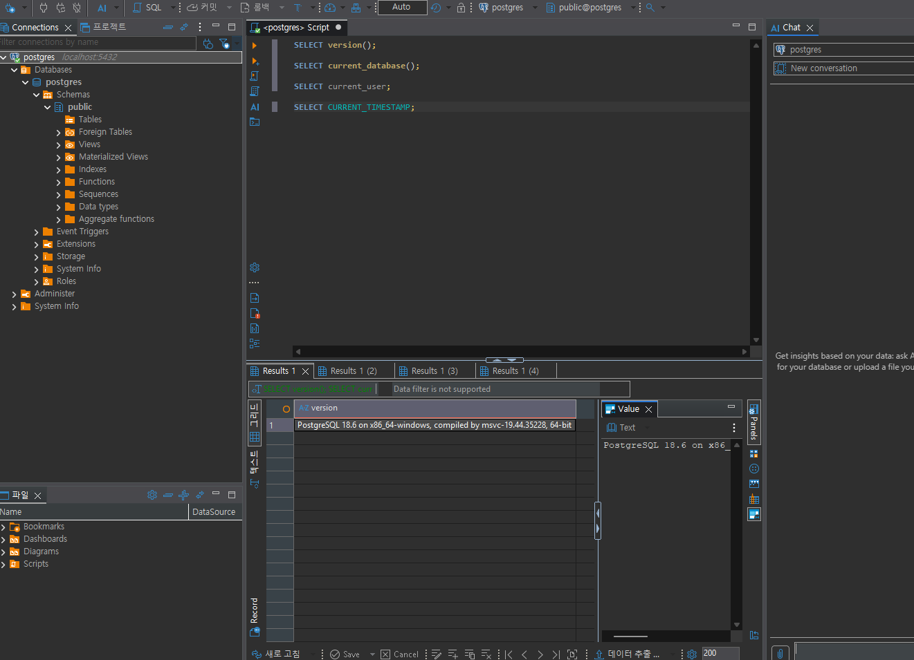
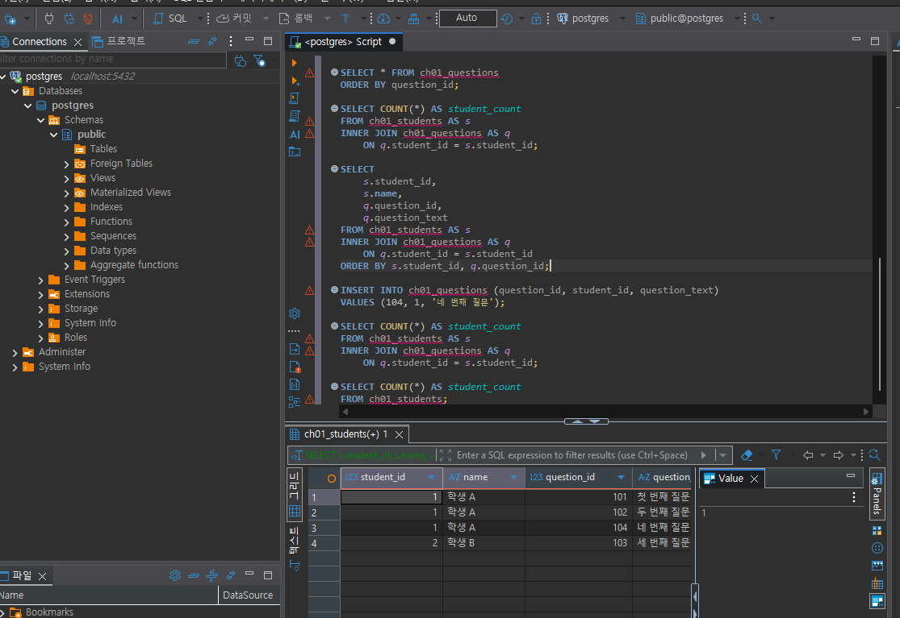
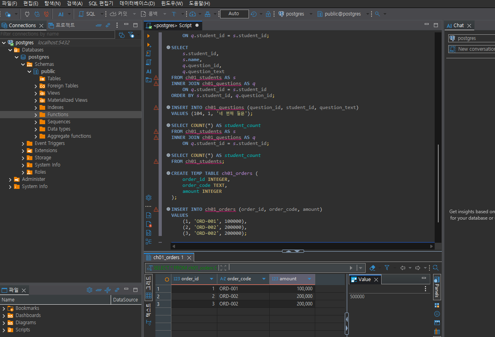
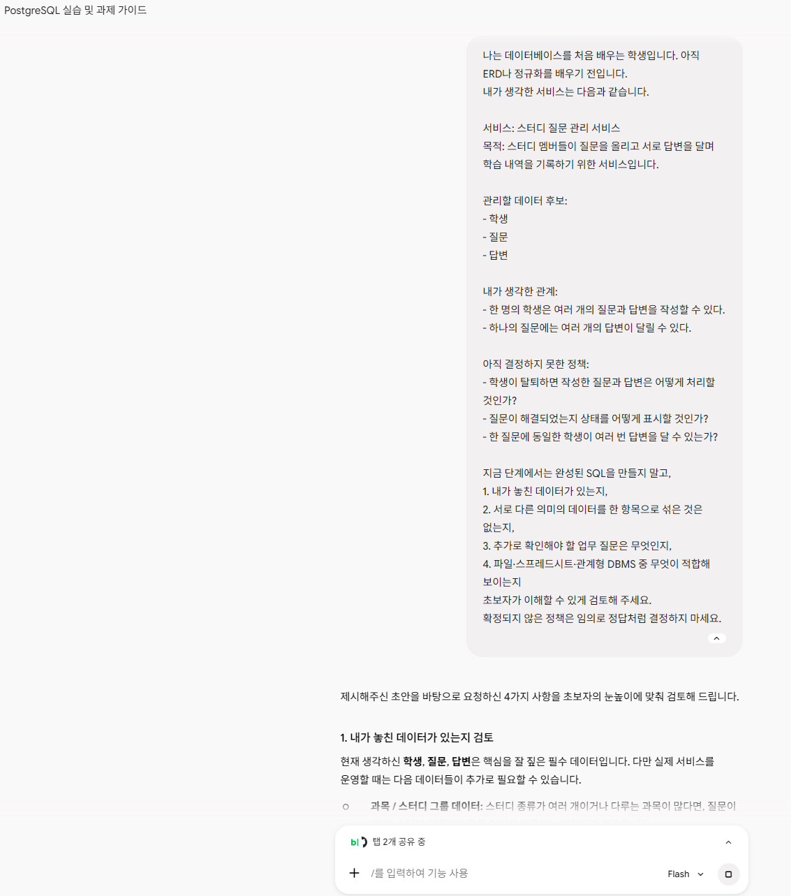

# Chapter 01 확장 실습 답안 템플릿

> **과제:** AI 시대에 데이터베이스를 왜 배워야 하는가  
> **사용 방법:** 이 파일을 내려받아 **본인의 GitHub 저장소**에 `chapter01_answer.md`라는 이름으로 저장한 뒤 답안을 작성합니다.  
> **제출 방법:** LMS에는 파일을 업로드하지 않고, **본인 GitHub 저장소의 `chapter01_answer.md` 파일 URL**을 제출합니다.

---

## 0. 학생 정보

| 항목 | 작성 내용 |
| --- | --- |
| 학번 | AX 2기 |
| 이름 | 황지나 |
| GitHub 계정 | pang789789 |
| 과제 작성일 | 2026-09-04 |
| 사용한 AI 도구 | gemini |

> 실제 비밀번호, API Key, 전체 DB 접속 URL, 개인정보는 이 파일이나 캡처 화면에 기록하지 않습니다.

---

# 1. PostgreSQL 실행 환경 확인

## 1-1. 실행한 SQL

```sql
SELECT version();
SELECT current_database();
SELECT current_user;
SELECT CURRENT_TIMESTAMP;
```

## 1-2. 실행 결과 기록

```text
- PostgreSQL 버전: `PostgreSQL 18.4 on x86_64-windows`
- 현재 데이터베이스: `postgres`
- 현재 사용자: `postgres`
- 실행 시각: `2026-09-04 16:21:24.763 +0900`

```

## 1-3. 내가 확인한 내용

1. SQL을 작성하는 프로그램과 PostgreSQL은 같은 프로그램인가요?

```text
나의 답: 아니요. DBeaver는 SQL을 작성하고 실행하는 프로그램이고, PostgreSQL은 실제로 데이터베이스를 관리하고 SQL을 실행하는 DBMS입니다.
```

2. `current_database()` 결과는 무엇을 의미하나요?

```text
나의 답: 현재 SQL을 실행하고 있는 데이터베이스의 이름을 알려줍니다.
```

3. SQL이 실행되었다는 사실만으로 데이터 내용도 올바르다고 할 수 있나요?

```text
나의 답: 아니요. SQL이 오류 없이 실행되었다고 해서 결과가 업무적으로 올바르다는 뜻은 아닙니다. 결과가 내가 구하려는 내용과 맞는지 직접 확인해야 합니다.
```

## 1-4. 증거 화면

**이미지 삽입 위치:**



---

# 2. Chapter 01 핵심 내용 복습

교재 문장을 그대로 복사하지 말고 자신의 말로 작성합니다.

| 본문의 핵심 | 나의 설명 |

### AI가 SQL을 만들어도 DB를 배워야 한다 
 AI가 SQL을 만들어 줄 수는 있지만, 결과를 제대로 가져오는지는 사람이 확인해야 하기 때문이다. DB의 기본 개념을 알아야 AI가 만든 SQL을 이해하고 잘못된 부분을 찾을 수 있다. 
### 데이터 구조가 중요하다 
 데이터가 어떤 의미를 가지고 있고 서로 어떻게 연결되어 있는지 알아야 올바르게 저장하고 조회할 수 있기 때문이다.
### SQL 결과를 검증해야 한다 
 SQL에 오류가 없이 실행되었다고 해서 결과가 항상 올바른 것은 아니기 때문이다. 내가 구하려는 값이 맞는지 예상한 결과와 실제 결과를 비교하고 확인해야 한다. 
### 데이터 품질이 AI 답변 품질에 영향을 준다 
 AI는 제공된 데이터를 바탕으로 결과를 만들기 때문에 데이터에 중복이나 누락 같은 문제가 있으면 AI의 분석 결과도 잘못될 수 있다. 따라서 AI에게 데이터를 제공하기 전에 데이터 자체가 올바른지 확인해야 한다. 
### 저장 방식은 데이터 양만 보고 선택하지 않는다 
 여러 사람이 동시에 수정하는지, 데이터끼리 어떤 관계가 있는지, 반복적인 조회와 집계가 필요한지, 권한과 백업·복구가 필요한지 등을 함께 고려해서 저장 방식을 선택해야 한다.

---

# 3. 실행 성공과 결과 정확성의 차이

## 3-1. SQL 실행 전 예상

학생 A는 질문 2개, 학생 B는 질문 1개, 학생 C는 질문이 없습니다.

```text
전체 학생 수: ___3___ 명
전체 질문 수: ___3___ 개
질문이 있는 학생 수: ___2___ 명
질문이 없는 학생 수: ___1___ 명
```

## 3-2. 임시 테이블 생성 및 데이터 입력 완료 확인

- [v] `ch01_students` 생성
- [v] `ch01_questions` 생성
- [v] 학생 3명 입력
- [v] 질문 3건 입력
- [v] 두 테이블의 데이터를 직접 조회

## 3-3. 잘못된 학생 수 SQL 실행 결과

실행한 SQL:

```sql
SELECT COUNT(*) AS student_count
FROM ch01_students AS s
INNER JOIN ch01_questions AS q
    ON q.student_id = s.student_id;
```

실행 결과: 3


## 3-4. JOIN 상세 결과 관찰

```text
학생 A가 나타난 행 수:2
학생 B가 나타난 행 수:1
학생 C가 나타난 행 수:0
```

### Q1. 학생 C가 왜 결과에서 사라졌나요?

```text
학생 C에게 연결된 질문 데이터가 없기 때문에 INNER JOIN 결과에서 제외되었습니다.

```

### Q2. 학생 A가 왜 여러 행으로 나타났나요?

```text
학생 A에게 연결된 질문이 2개 있기 때문에 질문 하나당 한 행씩 만들어져 총 2개의 행으로 나타났습니다.

```

### Q3. 위 `COUNT(*)`가 실제로 세고 있었던 것은 무엇인가요?

```text
학생의 수가 아니라 INNER JOIN으로 만들어진 결과 행의 개수를 세고 있었습니다. 학생 A의 2개 행과 학생 B의 1개 행을 합쳐 총 3개 행을 센 것입니다.

```

### Q4. 결과 숫자가 우연히 실제 학생 수와 같아도 바로 믿으면 안 되는 이유는 무엇인가요?

```text
AI가 만든 것처럼 보이는 SQL을 실행한 결과 `3`이 나왔다.

하지만 이 값은 INNER JOIN으로 연결된 결과 행의 개수를 센 것이다.

학생 A는 질문이 2개라서 2개의 행으로 나오고, 학생 B는 질문이 1개라서 1개의 행으로 나온다. 학생 C는 질문이 없기 때문에 INNER JOIN 결과에서 제외된다.

따라서 결과는 A 2행 + B 1행 = 총 3행이 된다.

즉, 결과 숫자 `3`이 실제 학생 수 `3명`과 우연히 같을 뿐, 이 SQL은 학생 수를 정확하게 세는 SQL이라고 볼 수 없다.

```

## 3-5. 질문 한 건을 추가한 뒤 다시 실행

추가한 데이터:

```text
(104, 1, '네 번째 질문')
```
```text

다시 실행한 결과:4
```
```text
AI SQL 결과:4
실제 학생 수:3
```

### 결과 해석

```text
데이터가 바뀐 뒤 무엇이 달라졌는지 : 학생 A에게 질문 하나가 추가되어 JOIN 결과의 행 수가 3개에서 4개로 늘어났다.

실제 학생 수는 왜 그대로인지 : 질문이 추가된 것이지 새로운 학생이 추가된 것은 아니기 때문에 실제 학생 수는 3명으로 그대로이다.

이 실험을 통해 알게 된 점 : JOIN 결과의 행 수와 실제 학생 수는 서로 다를 수 있으며, COUNT(*)의 결과가 우연히 실제 학생 수와 같더라도 올바른 결과라고 판단하면 안 된다.
```

## 3-6. 학생 테이블을 직접 센 결과

```sql
SELECT COUNT(*) AS student_count
FROM ch01_students;
```
```text
결과:3

```

### 두 SQL의 차이를 내 말로 설명

```text
첫 번째 SQL은 만들어진 결과 행의 개수를 세고 있었다.

두 번째 SQL은 학생 테이블에 실제로 존재하는 학생 행의 개수를 세고 있었다.

SQL을 검토할 때는 문법보다 먼저
내가 구하려는 값과 SQL이 실제로 세고 있는 대상이 같은지를 확인해야 한다.
```

## 3-7. 증거 화면



---

# 4. 잘못된 데이터가 결과를 바꾸는 과정

## 4-1. 주문 데이터 확인

다음 데이터를 입력한 뒤 실제 결과를 확인합니다.

```text
ORD-001, 100000
ORD-002, 200000
ORD-002, 200000
```

## 4-2. 실행 전 예상

업무적으로 주문이 `ORD-001`, `ORD-002` 두 건이고 `order_code`가 주문을 고유하게 구분한다고 **가정할 경우** 예상 합계:

```text
_____300000_____ 원
```

> 위 가정 자체가 실제 업무 규칙인지 확인해야 한다는 점도 기억합니다.

## 4-3. SQL 합계

```sql
SELECT SUM(amount) AS total_amount
FROM ch01_orders;
```

실제 결과:

```text
____500000______ 원
```

## 4-4. 결과 해석

### `SUM` 문법 자체가 잘못된 것인가요?

```text

아니요. SUM은 입력된 행의 amount 값을 합산하는 정상적인 집계 함수입니다.

```

### 결과 차이의 원인은 무엇인가요?

```text

ORD-002가 두 번 입력되어 있기 때문에 같은 주문이 중복 입력된 것으로 가정하면 200000원이 한 번 더 합산되었습니다.

```

### SQL이 정확하게 실행되어도 업무 숫자가 잘못될 수 있는 이유를 설명하세요.

```text

SQL은 테이블에 저장된 데이터를 기준으로 정확하게 계산하기 때문에 문법이나 실행에 문제가 없어도 데이터 자체에 중복이나 오류가 있으면 업무적으로 잘못된 숫자가 나올 수 있습니다.

```

## 4-5. AI에게 같은 데이터를 분석시킨 결과

AI가 계산한 합계:

```text

500000원

```

AI가 중복 가능성을 언급했나요?

```text

네, ORD-002라는 동일한 주문 코드와 200,000원이라는 같은 금액이 두 번 나타나고 있으므로 중복 데이터일 가능성이 높습니다. 사용자가 결제 버튼을 두 번 클릭했거나, 시스템 간 데이터를 연동하는 과정에서 오류가 발생해 같은 주문이 두 번 적재되었을 수 있습니다.

```

AI가 `ORD-002` 두 행이 실제 두 주문인지 중복 입력인지 스스로 확정할 수 있나요? 이유도 적으세요.

```text

아니요. 데이터만 보고는 같은 주문의 중복 입력인지 실제로 동일한 주문 코드가 사용된 두 건의 주문인지 업무 규칙을 알 수 없기 때문입니다.

```

추가로 확인해야 할 업무 규칙:

```text

1. order_code가 주문을 고유하게 구분하는 값인지 확인한다.
2. 같은 order_code가 여러 번 입력될 수 있는지 확인한다.
3. 중복된 주문이 실제 주문인지 잘못 입력된 데이터인지 확인한다.

```

내가 최종적으로 내린 판단:

```text

ORD-002가 중복 입력된 데이터인지 실제로 두 건의 주문을 의미하는지 업무 규칙과 원본 데이터를 확인한 뒤 합계를 판단해야 한다.

```

## 4-6. 증거 화면



---

# 5. 파일·스프레드시트·DBMS 선택 연습

각 사례에 대해 **AI에게 묻기 전에 먼저 본인의 판단을 작성**합니다.

## 사례 A. 개인 독서 기록

```text
나의 선택 : 스프레드시트
선택 이유 : 개인적으로 관리하는 독서 기록은 데이터 양이 많지 않고 여러 사람이 동시에 수정할 필요가 없기 때문이다.
어떤 조건이 추가되면 다른 방식으로 바꿀 것인지 : 여러 사람이 함께 기록하거나 데이터가 크게 증가하고 반복적인 검색이나 집계가 필요해지면 DBMS를 고려할 것이다.
```

## 사례 B. 동아리 행사 신청 명단

```text
나의 선택 : 스프레드시트
선택 이유 : 소규모 동아리에서 행사 신청 명단을 관리하는 경우에는 비교적 간단하게 입력하고 확인할 수 있기 때문이다.
어떤 조건이 추가되면 다른 방식으로 바꿀 것인지 : 신청자가 많아지고 여러 사람이 동시에 수정하거나 회원, 행사, 신청 정보 사이의 관계를 관리해야 한다면 DBMS를 고려할 것이다.
```

## 사례 C. 온라인 강의 서비스

```text
나의 선택 : DBMS
선택 이유 : 온라인 강의 서비스는 회원, 강의, 수강, 결제 등의 데이터가 서로 연결되고 여러 사용자가 동시에 서비스를 이용하기 때문이다.
어떤 조건이 추가되면 다른 방식으로 바꿀 것인지 : 데이터의 관계가 줄어들고 서비스 규모가 매우 작아져 지속적인 관리가 필요하지 않다면 다른 저장 방식을 검토할 수 있다.
```

## 판단 기준 체크

- [v] 데이터 증가
- [v] 여러 사용자의 동시 수정
- [v] 데이터 사이의 관계
- [v] 반복 조회와 집계
- [v] 정확성·일관성
- [v] 변경 이력
- [v] 권한 구분
- [v] 백업·복구
- [v] 웹·앱에서 지속 사용

### 데이터가 적으면 무조건 스프레드시트를 사용해야 하나요?

```text
아니요. 데이터의 양뿐만 아니라 여러 사람이 동시에 수정하는지, 데이터 사이의 관계가 있는지, 반복적인 조회와 집계가 필요한지, 정확성과 권한 관리 및 백업·복구가 필요한지 등을 함께 고려해야 합니다.
```

---

# 6. 나만의 서비스 데이터 구조 초안

> 이 내용은 이후 Chapter에서 계속 확장할 수 있으므로 신중하게 작성합니다.

## 6-1. 서비스 정의

```text
서비스 이름:AI 튜터링 질문 관리 서비스

이 서비스는
학생이 학습 중 작성한 질문과 튜터의 답변, 관련 학습 자료를 관리하고 질문 데이터를 분석하기 위한 서비스이다.
```

## 6-2. 관리할 데이터 후보

```text
1. 학생
2. 질문
3. 튜터 답변
4. 학습 자료
5. 질문과 학습 자료의 연결 정보
```

## 6-3. 한 행의 의미

| 데이터 후보 | 한 행의 의미 |
| --- | --- |
| 학생 | 한 명의 학생을 나타낸다. |
| 질문 | 학생이 학습 중 작성한 질문 하나를 나타낸다. |
| 튜터 답변 | 질문 하나에 대한 튜터의 답변 하나를 나타낸다. |

## 6-4. 관계를 자연어로 설명

```text
1. 한 명의 학생은 여러 개의 질문을 작성할 수 있다.
2. 하나의 질문에는 튜터의 답변이 연결될 수 있다.
3. 하나의 질문은 여러 개의 학습 자료와 연결될 수 있고, 하나의 학습 자료도 여러 질문과 연결될 수 있다.
```

## 6-5. 아직 결정하지 않은 정책

```text
Q1. 하나의 질문에 튜터가 여러 번 답변할 수 있도록 할 것인가?
Q2. 질문에 답변이 등록되지 않은 상태도 허용할 것인가?
Q3. 하나의 학습 자료를 여러 질문에 연결할 수 있도록 할 것인가?
```

> 확정되지 않은 정책을 AI가 임의로 결정한 경우 그대로 받아들이지 않습니다.

---

# 7. AI를 검토자로 활용하기

## 7-1. 내가 AI에게 전달한 핵심 프롬프트

개인정보나 비밀번호 등 민감한 내용은 제거한 뒤 기록합니다.

```text

학생, 질문, 답변을 관리하는 스터디 질문 관리 서비스를 만들려고 합니다.

학생과 질문의 관계를 포함해서 필요한 데이터 후보와 데이터 구조를 검토해 주세요.

제가 결정하지 않은 업무 규칙은 임의로 확정하지 말고, 확인이 필요한 질문으로 구분해 주세요.

```

## 7-2. AI의 주요 제안과 나의 판단

최소 5개를 작성합니다.

| AI의 제안 | 수용 / 수정 / 거절 | 나의 판단 근거 |
| --- | --- | --- |
| **'스터디/과목' 데이터 추가 제안** | 수용 | 여러 종류의 스터디가 동시에 운영될 경우, 질문이 어떤 과목에 속하는지 분류하는 데이터가 반드시 필요하다는 점에 동의함. |
| **'태그/카테고리' 데이터 추가 제안** | 수정 | 검색 편의성을 위한 태그 기능의 필요성은 공감하지만, 초기 설계부터 넣으면 구조가 복잡해질 수 있어 우선은 '과목' 데이터만 유지하고 태그는 추후 확장 기능으로 미루기로 함. |
| **질문 진행 상태(대기중/완료) 항목 추가 제안** | 수용 | 다른 학생이나 멘토가 답변이 필요한 질문을 빠르게 찾으려면, 질문 자체에 해결 여부를 나타내는 상태 데이터가 있어야 한다는 점을 깨닫고 반영함. |
| **탈퇴한 학생의 데이터 처리 정책 확인 요청** | 수용 | 전혀 고려하지 못했던 부분임. 게시판 특성상 작성자가 탈퇴하더라도 질문/답변 기록은 다른 학생들에게 유용하므로, 데이터는 남기고 이름만 가리는 정책을 세우기로 함. |
| **첨부파일이나 이미지 데이터를 관리해야 한다는 제안 (가정)** | 거절 | AI가 임의로 파일 업로드 기능이 필요할 것이라 가정하고 제안했으나, 현재 서비스 목적은 텍스트 중심의 가벼운 문답이므로 저장 공간과 구조를 복잡하게 만드는 파일 데이터는 관리하지 않기로 함. |

## 7-3. AI에게 자기 답변을 다시 비판하도록 요청한 결과

첫 번째 답변과 달라진 점:

```text
처음에는 단순히 관리할 항목(과목, 태그 등)을 늘리라는 '기능 확장' 위주의 제안이었으나, 스스로 비판한 후에는 데이터의 수명(Lifecycle)과 열람 권한 등 '업무 규칙의 예외 상황'을 짚어내는 방향으로 답변이 깊어졌음.
```

AI가 처음에 임의로 가정했던 내용:

```text
1. 모든 질문과 답변은 서비스에 접속한 모든 학생에게 항상 '공개'된다고 당연하게 가정함. (비밀글이나 그룹별 접근 권한을 고려하지 않음)
2. 질문에 답변이 달리면 그것으로 소통이 끝난다고 가정함. (답변에 대한 '재질문'이나 '댓글' 데이터를 전혀 고려하지 않음)
```

추가로 업무 담당자에게 확인해야 한다고 판단한 내용:

```text
1. 학생이 특정 멘토나 강사에게만 보이도록 '비밀 질문'을 남길 수 있는 기능이 필요한가? (권한 데이터 추가 필요 여부)
2. 한 기수의 스터디 기간이 완전히 종료된 후, 기존 질문과 답변 데이터는 수정/삭제 불가(읽기 전용) 상태로 전환해야 하는가?
3. 학생들의 답변 참여를 유도하기 위한 '채택 포인트'나 '내공' 같은 보상 관련 데이터가 추가로 필요한가?
```

## 7-4. AI 활용에 대한 나의 평가

```text
가장 유용했던 부분:
내가 미처 생각하지 못한 예외 상황(예: 탈퇴한 학생의 게시글 처리, 질문의 해결 상태 관리 등)을 구체적으로 짚어준 점이 가장 유용했다. 단순한 데이터 항목 확장이 아니라 데이터의 수명주기를 고민하게 되었다.

수정하거나 거절한 부분:
이미지 등 파일 첨부 데이터를 관리하라는 제안과, 검색을 위한 복잡한 태그 시스템 도입 제안을 거절하거나 수정(보류)했다.

그렇게 판단한 근거:
처음부터 너무 많은 종류의 데이터를 관리하려고 하면 테이블 구조가 지나치게 복잡해지기 때문이다. 핵심 기능인 '텍스트 위주의 질문과 답변' 관리에 먼저 집중하고, 파일이나 태그 같은 부가 데이터는 서비스가 안정된 후 확장하는 것이 맞다고 판단했다.

AI가 없었다면 놓쳤을 가능성이 있는 질문:
- "학생이 탈퇴할 경우, 그 학생이 쓴 질문과 답변은 같이 삭제할 것인가, 이름만 가리고 남길 것인가?"
- "스터디 기간이 완전히 종료된 후, 기존 문답 데이터는 수정/삭제 불가(읽기 전용) 상태로 전환해야 하는가?"
```

## 7-5. AI 활용 증거 화면

AI 대화 전체를 캡처할 필요는 없습니다. 핵심 요청과 검토 과정이 보이는 화면 1장 정도면 충분합니다.



---

# 8. 기준 데이터·파생 데이터·AI 생성 결과 구분

내 서비스에 맞게 작성합니다.

| 구분 | 내 서비스의 예 | 판단 이유 |
| --- | --- | --- |
| 기준 데이터 | 학생 정보와 학생이 작성한 질문 | 실제로 저장되는 원본 데이터이기 때문이다. |
| 파생 데이터 | 학생별 질문 개수 | 저장된 질문 데이터를 집계해서 만들어지는 값이기 때문이다. |
| AI 생성 결과 | 질문 내용에 대한 AI 답변 | 원본 질문 데이터를 바탕으로 AI가 생성하는 결과이기 때문이다. |

### 기준 데이터가 변경되면 파생 데이터는 어떻게 해야 하나요?

```text

기준 데이터가 변경되면 파생 데이터도 변경된 기준 데이터를 반영해서 다시 계산하거나 갱신해야 한다.

```

### AI 결과만 있고 원본 데이터가 없다면 결과를 충분히 검증할 수 있나요?

```text

아니요. AI가 어떤 원본 데이터를 바탕으로 결과를 만들었는지 확인할 수 없기 때문에 결과가 올바른지 충분히 검증하기 어렵다.

```

---

# 9. 최종 성찰

아래 세 문장은 반드시 **본인의 말**로 작성합니다.

```text
1. SQL이 실행되어도 결과를 바로 믿으면 안 되는 이유는
   오류 없이 실행되더라도 내가 원하는 값을 제대로 계산했는지는 별도로 확인해야 하기 때문이다.

2. AI를 데이터베이스 학습에 활용할 때 가장 중요한 것은
   데이터와 결과를 직접 확인하는 것이다.

3. 이번 실습 이후 내가 더 확인하고 싶은 것은
   실제 서비스에서 데이터 사이의 관계를 어떻게 설계하고 중복이나 잘못된 데이터를 어떻게 방지하는지이다.
```

## 이번 Chapter에서 새롭게 알게 된 점 3가지

```text

1. SQL이 오류 없이 실행되어도 결과가 항상 올바른 것은 아니라는 점을 알게 되었다.

2. INNER JOIN에서는 연결된 데이터의 개수에 따라 한 학생이 여러 행으로 나타나거나 연결된 데이터가 없는 학생이 결과에서 제외될 수 있다는 점을 알게 되었다.

3. 데이터의 중복이나 품질 문제가 SQL의 정확한 계산 결과에도 영향을 줄 수 있다는 점을 알게 되었다.

```

## 아직 이해가 명확하지 않은 부분

```text

1. 실제 서비스에서 여러 테이블 사이의 관계를 어떻게 설계하는지

2. 중복 데이터를 데이터베이스에서 미리 방지하는 방법

```

---

# 10. 제출 전 자기 점검

- [v] PostgreSQL 실행 화면을 확인했다.
- [v] SQL 실행 전에 예상 결과를 먼저 작성했다.
- [v] `INNER JOIN` 예제에서 누락과 반복을 설명할 수 있다.
- [v] 숫자가 우연히 같아도 의미가 다를 수 있음을 설명했다.
- [v] 중복 데이터가 집계 결과에 미치는 영향을 확인했다.
- [v] 저장 방식을 데이터 양만으로 판단하지 않았다.
- [v] 개인 서비스 주제를 하나 정했다.
- [v] 데이터 후보와 한 행의 의미를 작성했다.
- [v] 미확정 정책을 최소 3개 작성했다.
- [v] AI 제안을 수용·수정·거절로 구분했다.
- [v] AI 제안에 대한 판단 근거를 작성했다.
- [v] 기준 데이터·파생 데이터·AI 결과를 구분했다.
- [v] 핵심 증거 이미지가 Markdown에서 정상적으로 보인다.
- [v] 비밀번호·API Key·개인정보가 노출되지 않았다.

---