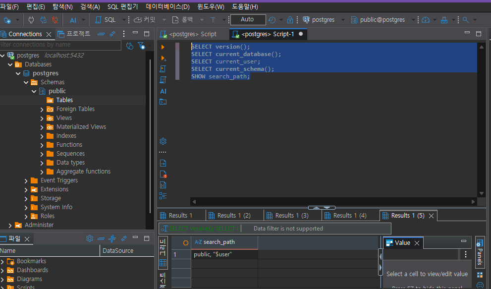
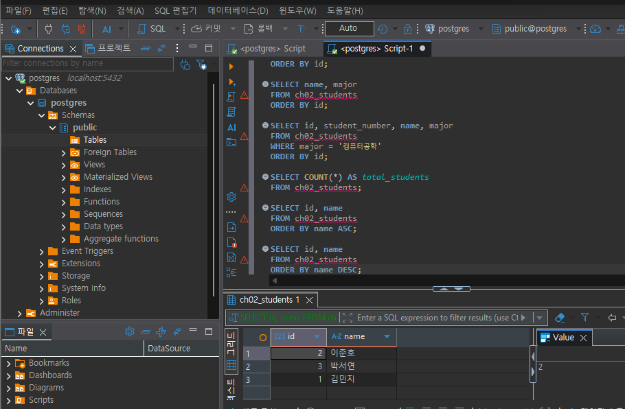
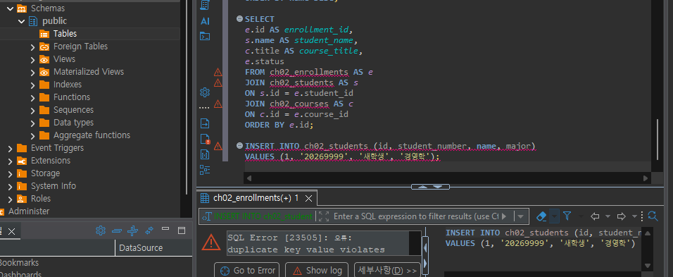
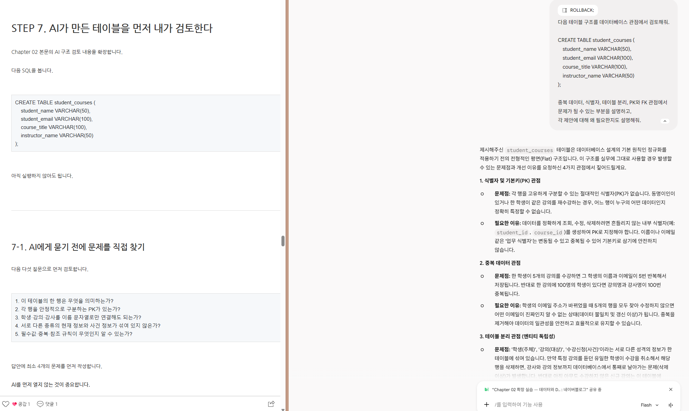

# Chapter 02 확장 실습 답안 템플릿

---

# 1. PostgreSQL에서 현재 위치 확인

## 1-1. 실행한 SQL

```sql
SELECT version();
SELECT current_database();
SELECT current_user;
SELECT current_schema();
SHOW search_path;
```

## 1-2. 실행 결과 기록

```text
PostgreSQL 버전: PostgreSQL 18.4 on x86_64-windows
현재 데이터베이스: postgres
현재 사용자: postgres
현재 스키마: public
search_path: "$user", public
```

## 1-3. 구조를 내 말로 설명

```text
PostgreSQL은:데이터베이스를 관리하는 DBMS이다.

현재 접속한 데이터베이스는:postgres

스키마는: 데이터베이스 안에서 테이블 등의 객체를 묶어서 관리하는 논리적인 공간이다.

DBeaver 또는 psql 같은 도구는:데이터베이스를 관리하기 위한 클라이언트 도구이다.
```

## 1-4. 계층 구조 완성

```text
사용자
→ PostgreSQL 서버
→ PostgreSQL DBMS
→ 데이터베이스
→ 스키마
→ 테이블
→ 행 / 열
```

## 1-5. 증거 화면

권장 경로:

```text
assignments/chapter02/images/step01_environment.png
```

```markdown

```

---

# 2. 데이터베이스 안의 스키마와 테이블 관찰

## 2-1. 스키마 조회 결과

실행한 SQL:

```sql
SELECT schema_name
FROM information_schema.schemata
ORDER BY schema_name;
```

관찰한 스키마 이름 중 3개 이내를 적습니다.

```text
1. information_schema
2. pg_catalog
3. public
```

### `public`은 무엇인가요?

```text
나의 설명:public은 PostgreSQL 데이터베이스에서 기본적으로 사용할 수 있는 스키마이다.
별도의 스키마를 지정하지 않고 테이블을 만들면 일반적으로 public 스키마에 생성된다.
```

### 데이터베이스와 스키마는 같은 것인가요?

```text
나의 설명:같지 않다.
데이터베이스는 데이터를 저장하고 관리하는 큰 단위이고,
스키마는 하나의 데이터베이스 안에서 테이블 등의 객체를 논리적으로 구분하는 단위이다.
```

## 2-2. 현재 보이는 테이블 조회

```sql
SELECT table_schema, table_name
FROM information_schema.tables
WHERE table_type = 'BASE TABLE'
  AND table_schema NOT IN ('pg_catalog', 'information_schema')
ORDER BY table_schema, table_name;
```

```text
조회된 사용자 테이블 수 또는 눈에 띈 테이블: Chapter 01에서 생성한 데이터를 확인할 수 있었다.

아직 테이블이 거의 없어도 괜찮은 이유:
데이터베이스는 처음부터 많은 테이블을 가지고 있어야 하는 것이 아니며,
필요한 업무 데이터를 기준으로 테이블을 설계하고 추가하면 되기 때문이다.

```

## 2-3. 관찰 정리

```text
PostgreSQL 서버 안에는 여러 데이터베이스가 있을 수 있다.
한 데이터베이스 안에는 여러 스키마가 있을 수 있다.
스키마 안에는 테이블과 같은 데이터베이스 객체가 존재한다.
```

---

# 3. TEMP TABLE로 테이블·행·열·키 직접 확인

## 3-1. 임시 테이블 생성 완료 확인

- [0] `ch02_students` 생성
- [0] `ch02_courses` 생성
- [0] `ch02_enrollments` 생성

각 테이블의 **한 행 의미**를 적습니다.

| 테이블 | 한 행의 의미 |
| --- | --- |
| `ch02_students` | 한 명의 학생 정보 |
| `ch02_courses` | 하나의 강의 정보 |
| `ch02_enrollments` | 한 학생의 한 강의 수강신청 정보 |

## 3-2. 열의 의미 확인

### `ch02_students`

| 열 | 값의 의미 | 내부 식별자 / 업무 식별자 / 일반 속성 |
| --- | --- | --- |
| `id` | 학생을 데이터베이스 내부에서 식별하는 번호 | 내부 식별자 |
| `student_number` | 학생의 학번 | 업무 식별자 |
| `name` | 학생 이름 | 일반 속성 |
| `major` | 학생 전공 | 일반 속성 |

### `ch02_enrollments`

| 열 | 값의 의미 | PK / FK / 일반 속성 |
| --- | --- | --- |
| `id` | 수강신청 한 건을 식별하는 번호 | PK |
| `student_id` | 수강신청한 학생의 ID | FK |
| `course_id` | 신청한 강의의 ID | FK |
| `status` | 수강신청 상태 | 일반 속성 |

## 3-3. 입력된 행 수

```text
students 행 수: 3
courses 행 수: 2
enrollments 행 수: 4
```

## 3-4. 내부 식별자와 업무 식별자

```text
students.id가 필요한 이유:
데이터베이스에서 학생 한 명을 안정적으로 식별하고 다른 테이블에서 참조하기 위해 필요하다.

student_number가 필요한 이유:
실제 학교 업무에서 학생을 구분하기 위해 사용하는 의미 있는 식별자이기 때문이다.

둘을 항상 같은 값으로 사용하지 않아도 되는 이유:
내부 ID는 데이터베이스의 관계와 참조를 위한 값이고 학번은 업무상 의미를 가진 값이기 때문이다.
업무 식별자가 변경되거나 형식이 바뀌더라도 내부 ID는 그대로 유지할 수 있다.
```

## 3-5. 숫자처럼 보이는 학번을 문자열로 저장한 이유

```text
나의 설명:학번은 계산할 숫자가 아니라 학생을 식별하기 위한 코드이기 때문이다.
앞자리 0이 포함될 수도 있고 학교의 규칙에 따라 문자나 다른 형식이 포함될 수도 있으므로 숫자형보다는 문자열로 저장하는 것이 적절하다고 생각한다.
```

---

# 4. 테이블과 조회 결과는 다르다

## 4-1. 원본 테이블 행 수

```text
ch02_students 전체 행 수:3
```

## 4-2. 일부 열만 조회

실행 SQL:

```sql
SELECT name, major
FROM ch02_students
ORDER BY id;
```

```text
원본 테이블의 열 수와 조회 결과의 열 수가 다른 이유:
SELECT에서 필요한 열만 선택했기 때문이다.
원본 테이블의 구조가 변경된 것이 아니라 조회 결과만 달라진 것이다.
```

## 4-3. 조건을 적용한 조회

실행 SQL:

```sql
SELECT id, student_number, name, major
FROM ch02_students
WHERE major = '컴퓨터공학'
ORDER BY id;
```

```text
원본 테이블 행 수: 3
조회 결과 행 수: 2
원본 테이블의 데이터가 삭제된 것인가?: 아니다.
그렇게 판단한 이유:
WHERE 조건에 맞는 행만 조회했을 뿐 실제 테이블의 데이터를 삭제하는 DELETE 명령을 실행한 것이 아니기 때문이다.
```

## 4-4. 정렬 결과 비교

```sql
SELECT id, name
FROM ch02_students
ORDER BY name ASC;

SELECT id, name
FROM ch02_students
ORDER BY name DESC;
```

```text
ASC 결과의 첫 학생: 김민지
DESC 결과의 첫 학생: 이준호

이 실험을 통해 ORDER BY에 대해 알게 된 점: 
조회 결과의 정렬 순서를 지정하는 것이며 뒤에 작성하는 조건이 정렬기준이 된다.
```

## 4-5. 증거 화면

권장 경로:

```text
assignments/chapter02/images/step04_result_set.png
```



---

# 5. PK와 FK를 실제로 관찰

## 5-1. 정상 데이터의 관계 읽기

다음 SQL 결과를 보고 작성합니다.

```sql
SELECT
    e.id AS enrollment_id,
    s.name AS student_name,
    c.title AS course_title,
    e.status
FROM ch02_enrollments AS e
JOIN ch02_students AS s
    ON s.id = e.student_id
JOIN ch02_courses AS c
    ON c.id = e.course_id
ORDER BY e.id;
```

```text
한 행이 의미하는 것:
한 명의 학생이 특정 강의에 신청한 하나의 수강신청 정보를 의미한다.

같은 student_id가 여러 enrollment 행에서 반복될 수 있는 이유:
한 학생이 여러 강의를 수강할 수 있기 때문이다.

같은 course_id가 여러 enrollment 행에서 반복될 수 있는 이유:
하나의 강의를 여러 학생이 수강할 수 있기 때문이다.
```

## 5-2. 기본키 중복 오류 관찰

중복 PK 입력을 시도한 결과:

```text
실행 성공 / 실패: 실패
오류 메시지에서 확인한 핵심 단어: duplicate key / unique constraint
왜 실패했다고 생각하는가:
PK는 각 행을 유일하게 식별해야 하므로 이미 존재하는 PK 값을 다시 입력할 수 없기 때문이다.
```

## 5-3. 존재하지 않는 학생을 참조하는 FK 오류 관찰

존재하지 않는 `student_id`를 사용한 수강신청 입력 결과:

```text
실행 성공 / 실패: 실패
오류 메시지에서 확인한 핵심 단어: foreign key constraint / key is not present
왜 실패했다고 생각하는가:
참조하려는 student_id가 부모 테이블인 ch02_students에 존재하지 않기 때문이다.
```

## 5-4. PK와 FK의 차이 정리

```text
PK는 각 행을 고유하게 식별하기 위한 키이다.

FK는 다른 테이블의 값을 참조하여 테이블 사이의 관계를 연결하기 위한 키이다.

FK 값이 여러 행에서 반복될 수 있는 이유는
한 부모 데이터가 여러 자식 데이터와 관계를 가질 수 있기 때문이다.
```

## 5-5. 증거 화면

권장 경로:

```text
assignments/chapter02/images/step05_pk_fk.png
```

> 오류 메시지는 전체 화면이 아니라 테이블명·constraint·참조 오류가 보이는 정도만 캡처합니다.



---

# 6. 관계와 카디널리티를 자연어로 설명

현재 임시 데이터 기준으로 작성합니다.

```text
학생 한 명은 여러 수강신청을 가질 수 있는가?:
예.

강의 한 개는 여러 수강신청을 가질 수 있는가?:
예.

수강신청 한 건은 학생 몇 명을 참조하는가?:
학생 한 명을 참조한다.

수강신청 한 건은 강의 몇 개를 참조하는가?:
강의 한 개를 참조한다.
```

아래 구조를 완성합니다.

```text
students 1 ── N enrollments N ── 1 courses
```

### 학생과 강의가 N:M 관계라고 볼 수 있는 이유

```text
나의 설명:
한 학생은 여러 강의를 수강할 수 있고,
한 강의도 여러 학생이 수강할 수 있기 때문이다.
수강신청 테이블이 학생과 강의 사이의 관계를 나타낸다.
```

> 아직 0개 허용 여부, 필수 관계, 삭제 정책까지 확정하지 않습니다. 그런 규칙은 Chapter 05~06에서 다룹니다.

---

# 7. AI가 만든 테이블 구조 직접 검토

## 7-1. AI에게 묻기 전에 내가 먼저 찾은 문제

다음 구조를 보고 최소 4개를 적습니다.

```sql
CREATE TABLE student_courses (
    student_name VARCHAR(50),
    student_email VARCHAR(100),
    course_title VARCHAR(100),
    instructor_name VARCHAR(50)
);
```

```text
문제 1.
학생과 강의 정보가 하나의 테이블에 함께 들어 있어 데이터가 중복될 수 있다.

문제 2.
student_name과 student_email이 여러 행에서 반복될 수 있다.

문제 3.
course_title과 instructor_name도 여러 수강 데이터에서 반복될 수 있다.

문제 4.
학생, 강의, 수강신청의 관계가 별도의 구조로 표현되지 않아
데이터를 관리하고 수정하기 어렵다.
```

## 7-2. AI 검토 요청 프롬프트

사용한 핵심 프롬프트를 기록합니다.

```text
다음 테이블 구조를 데이터베이스 관점에서 검토해줘.

CREATE TABLE student_courses (
    student_name VARCHAR(50),
    student_email VARCHAR(100),
    course_title VARCHAR(100),
    instructor_name VARCHAR(50)
);

중복 데이터, 식별자, 테이블 분리, PK와 FK 관점에서
문제가 될 수 있는 부분을 설명하고,
각 제안에 대해 왜 필요한지도 설명해줘.
```

## 7-3. AI 제안과 나의 판단

| AI의 지적 또는 제안 | 동의 / 수정 / 보류 | 나의 근거 |
| --- | --- | --- |
| **기본키(PK) 부재 지적**: 각 행을 고유하게 구분할 식별자가 없으므로 인조키(내부 식별자)를 지정해야 함 | 동의 | 이름이나 이메일 같은 업무 식별자는 중복되거나 변경될 위험이 있으므로, 데이터의 수정·삭제를 안전하게 처리하기 위한 내부 PK가 필수적임. |
| **데이터 중복 문제 지적**: 한 학생이 여러 강의를 수강할 경우 학생 정보가 반복 저장되어 불일치가 발생함 | 동의 | 동일한 정보가 여러 행에 중복 저장되면 데이터 수정 시 일부만 반영되는 갱신 이상(Update Anomaly)이 발생하여 일관성이 깨질 수 있음. |
| **테이블 분리 제안**: 학생, 강의, 수강신청을 독립된 3개 테이블로 분리해야 함 | 동의 | 서로 다른 성격의 엔티티(주체·대상·사건)를 한 표에 두면, 수강 취소 시 강의 정보까지 사라지는 삭제 이상이나 수강생 없는 강의 등록이 불가능한 삽입 이상이 생김. |
| **외래키(FK) 적용 제안**: 수강신청 테이블의 student_id, course_id에 FK 제약조건을 설정해야 함 | 동의 | FK 제약조건을 지정해야 존재하지 않는 학생이나 강의 ID가 입력되는 것을 DBMS 차원에서 원천 차단(참조 무결성 보장)할 수 있음. |
| **FK 중복 가능 여부 설명**: 외래키(FK) 값은 고유(UNIQUE)해야 하므로 중복 입력할 수 없음 | 수정 | FK는 1:N 관계에서 'N'에 해당하는 여러 행에 동일한 값(예: 한 학생의 여러 수강신청)이 반복해서 저장될 수 있으며, 자동으로 UNIQUE가 되지 않음. |

## 7-4. 본문과 대조한 항목

AI 설명 중 최소 하나를 `chapter02.md`와 비교합니다.

```text
AI가 설명한 내용:
학생과 강의가 여러 관계를 가질 경우 중간 관계를 나타내는 구조가 필요하다는 내용.

본문에서 확인한 내용:
Chapter 02의 students, courses, enrollments 구조에서도
enrollments가 학생과 강의의 관계를 나타낸다.

일치 / 부분 일치 / 수정 필요:
일치.

내가 최종적으로 이해한 내용:
학생과 강의 자체를 하나의 테이블에 반복해서 저장하기보다
각 데이터를 분리하고 수강신청과 같은 관계 데이터를 별도로 관리하면
데이터의 의미와 관계를 더 명확하게 표현할 수 있다.
```

## 7-5. 증거 화면

권장 경로:

```text
assignments/chapter02/images/step07_ai_review.png
```



---

# 8. Chapter 01의 개인 서비스 아이디어를 DB 용어로 다시 표현

Chapter 01에서 정한 개인 서비스 주제를 그대로 사용하거나 새 주제를 정해도 됩니다.

## 8-1. 서비스 기본 정보

```text
서비스 이름:
AI 튜터링 질문 관리 서비스

서비스 목적:
학생의 질문과 튜터의 답변, 학습 자료 등을 관리하고
질문 데이터를 분석하기 위한 서비스이다.
```

## 8-2. PostgreSQL 구조 후보

```text
데이터베이스 이름 후보:
tutor_project

스키마 이름 후보:
tutor
```

> 아직 실제 데이터베이스나 스키마를 생성하지 않아도 됩니다.

## 8-3. 테이블 후보와 한 행 의미

최소 3개를 작성합니다.

| 테이블 후보 | 한 행의 의미 | 내부 ID 후보 | 업무 식별자 후보 |
| --- | --- | --- | --- |
| students | 한 명의 학생을 나타낸다. | student_id | student_number |
| questions | 학생이 작성한 질문 하나를 나타낸다. | question_id | 별도 업무 식별자 검토 |
| answers | 질문에 대한 튜터의 답변 하나를 나타낸다. | answer_id | 별도 업무 식별자 검토 |

## 8-4. FK 후보

```text
1. questions.student_id → students.student_id
   이유:
   질문을 작성한 학생을 연결하기 위해 필요하다.

2. answers.question_id → questions.question_id
   이유:
   튜터의 답변이 어떤 질문에 대한 것인지 연결하기 위해 필요하다.
```

## 8-5. 자연어 관계 문장

```text
1. 한 학생은 여러 질문을 작성할 수 있다.
2. 하나의 질문에는 하나 이상의 튜터 답변이 연결될 수 있다.
3. 하나의 질문과 학습 자료를 연결하여 관련 자료를 관리할 수 있다.
```

## 8-6. 아직 확정하지 않을 정책

```text
Q1. 하나의 질문에 여러 개의 튜터 답변을 허용할 것인가?
Q2. 답변이 없는 질문도 저장할 것인가?
Q3. 하나의 질문에 여러 학습 자료를 연결할 것인가?
```

---

# 9. AI를 개인 구조의 검토자로 사용

## 9-1. 사용한 프롬프트

```text
내가 설계한 AI 튜터링 질문 관리 서비스의 데이터 구조를 검토해줘.

학생, 질문, 튜터 답변, 학습 자료를 관리한다고 할 때
테이블 분리, PK와 FK, 관계, 데이터 중복 가능성,
아직 결정하지 않아야 할 업무 정책을 검토해줘.

확정되지 않은 업무 규칙은 임의로 결정하지 말고
확인해야 할 질문으로 구분해줘.
```

## 9-2. AI가 질문한 내용 중 유용했던 것

```text
1. 하나의 질문에 답변이 여러 개일 수 있는지 확인해야 한다.
2. 질문과 학습 자료가 어떤 관계를 가지는지 결정해야 한다.
3. 학생을 구분하기 위한 내부 ID와 학번을 구분할 필요가 있다.
```

## 9-3. AI가 너무 빨리 결정한 내용 또는 내가 보류한 내용

```text
1. 질문 하나에 답변을 하나만 연결할지는 아직 확정하지 않았다.
2. 질문과 학습 자료의 정확한 연결 정책은 실제 서비스 요구사항을 확인한 뒤 결정해야 한다.
```

## 9-4. 검토 후 수정한 구조

| 수정 전 | 수정 후 | 수정 이유 |
| --- | --- | --- |
| 학생과 질문을 하나의 구조로 생각함 | students와 questions를 분리 | 학생과 질문은 서로 다른 종류의 데이터이기 때문이다. |
| 질문과 답변의 관계를 단순하게 생각함 | questions와 answers의 관계를 별도로 검토 | 하나의 질문에 여러 답변이 가능한지 정책 확인이 필요하다. |
| 학습 자료를 단순 속성으로 생각함 | 별도 테이블 후보로 검토 | 하나의 자료가 여러 질문과 연결될 가능성을 고려하기 위해서이다. |

---

# 10. 최종 개념 정리

아래 문장을 본인의 말로 완성합니다.

```text
PostgreSQL은 데이터베이스를 관리하고 SQL을 실행하는 DBMS이다.

DBeaver 또는 psql은 PostgreSQL에 접속해서 SQL을 작성하고 실행하는 도구이다.

데이터베이스와 스키마의 차이는 데이터베이스가 더 큰 관리 단위이고
스키마는 데이터베이스 안에서 객체를 구분하여 관리하는 단위라는 점이다.

테이블 한 행은 해당 테이블이 표현하는 하나의 데이터를 의미한다.

조회 결과가 원본 테이블과 다른 이유는 SELECT, WHERE, ORDER BY 등의
조건에 따라 필요한 열이나 행만 선택해서 보여줄 수 있기 때문이다.

내부 식별자와 업무 식별자의 차이는 내부 식별자는 데이터베이스에서
데이터를 구분하기 위한 값이고 업무 식별자는 실제 업무에서 의미를
가지고 데이터를 식별하는 값이라는 점이다.

PK는 테이블의 각 행을 고유하게 식별하기 위한 키이다.

FK는 다른 테이블의 데이터를 참조하여 테이블 사이의 관계를 연결하기 위한 키이다.
```

---

# 11. 이번 Chapter에서 새롭게 알게 된 점

최소 3개를 작성합니다.

```text
1. 데이터베이스와 스키마는 같은 개념이 아니라 서로 다른 계층의 관리 단위라는 것을 알게 되었다.
2. 조회 결과는 원본 테이블 자체가 아니며 SELECT와 WHERE 등의 조건에 따라 행과 열이 달라질 수 있다는 것을 알게 되었다.
3. PK는 데이터를 고유하게 식별하고 FK는 테이블 사이의 관계를 연결한다는 것을 실제 데이터로 확인할 수 있었다.
```

## 아직 헷갈리는 내용

```text
1. 업무 식별자를 어떤 기준으로 정하고 내부 식별자와 어떻게 구분할지 더 연습이 필요하다.
2. 실제 서비스에서 PK와 FK의 삭제 및 변경 정책을 어떻게 정하는지 더 알아보고 싶다.
```

## AI에게 다시 질문하고 싶은 내용

```text
실제 서비스에서 내부 식별자와 업무 식별자를 선택할 때
어떤 기준으로 결정하는지, 그리고 PK와 FK의 변경 및 삭제 정책을
어떻게 정하는지 질문하고 싶다.
```

---

# 12. 제출 전 자기 점검

- [0] PostgreSQL에서 현재 database / schema / search_path를 확인했다.
- [0] DBMS, database, schema, table을 구분해서 설명할 수 있다.
- [0] TEMP TABLE 3개를 생성하고 직접 데이터를 조회했다.
- [0] 각 테이블의 한 행 의미를 작성했다.
- [0] 테이블과 조회 결과가 다르다는 것을 실제 SQL로 확인했다.
- [0] `ORDER BY`를 사용하지 않으면 업무 순서를 가정하면 안 된다는 점을 이해했다.
- [0] 내부 식별자와 업무 식별자의 차이를 설명할 수 있다.
- [0] PK 중복 입력 실패를 직접 확인했다.
- [0] 존재하지 않는 FK 참조 실패를 직접 확인했다.
- [0] FK 값이 반복될 수 있는 이유를 설명할 수 있다.
- [0] AI가 만든 테이블을 내가 먼저 검토했다.
- [0] AI 설명 중 최소 하나를 본문과 대조했다.
- [0] 개인 서비스의 테이블 후보를 3개 이상 작성했다.
- [0] 개인 서비스의 FK 후보와 미확정 정책을 기록했다.
- [0] 실제 비밀번호·API Key·민감한 접속 정보가 포함되지 않았는지 확인했다.
- [0] 이미지 링크가 GitHub에서 정상적으로 보이는지 확인했다.

---

## 최종 확인

- [0] 위 URL을 로그아웃 상태 또는 다른 브라우저에서 열어도 확인 가능하다.
- [0] Markdown이 정상 렌더링된다.
- [0] 이미지가 깨지지 않는다.
- [0] LMS에 교수자 템플릿 URL이 아니라 **내 답안 파일 URL**을 제출했다.