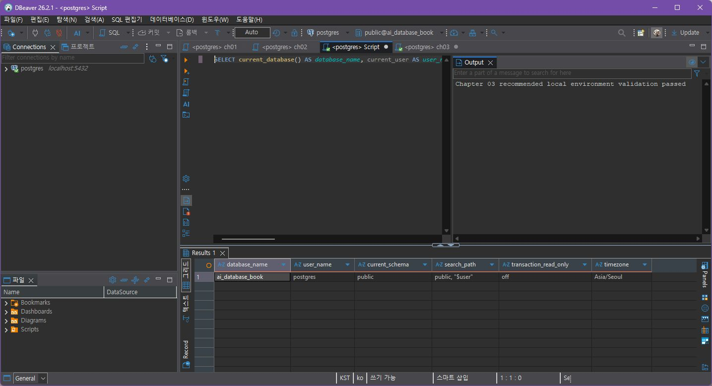
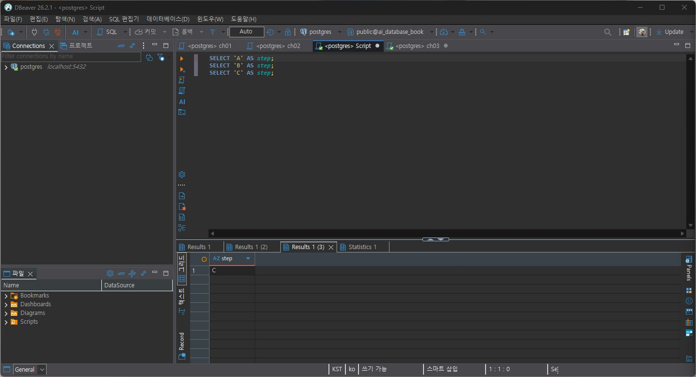
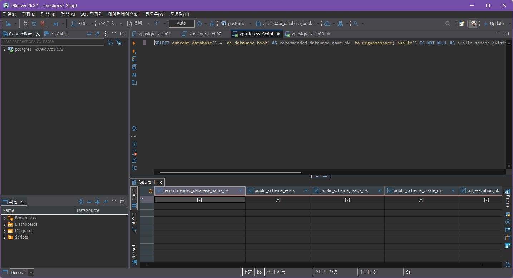
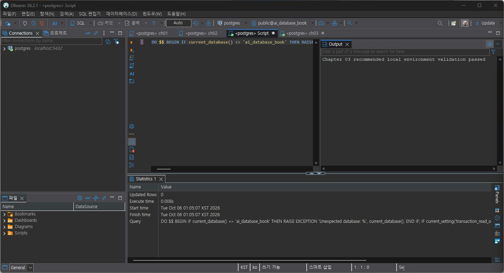
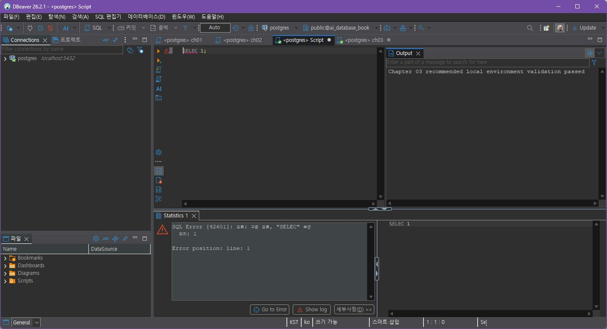
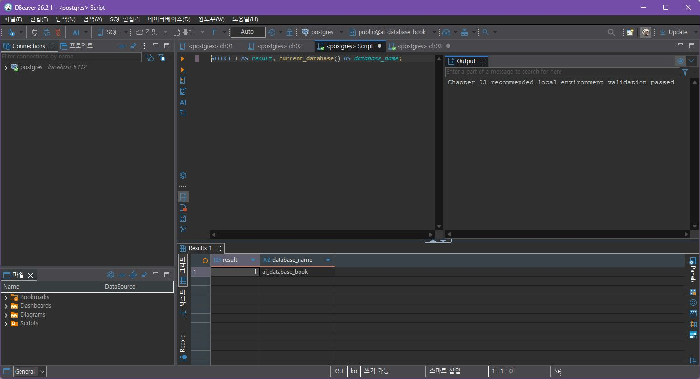

# Chapter 03 확장 실습 답안 템플릿

> **과제:** PostgreSQL과 DBeaver로 실습 환경 검증하기  
> **사용 방법:** 이 파일을 내려받아 본인의 GitHub 저장소에 `chapter03_answer.md`라는 이름으로 저장한 뒤 실습하면서 바로 작성합니다.  
> **제출 방법:** LMS에는 파일을 직접 업로드하지 않고, **본인 GitHub 저장소의 `chapter03_answer.md` 파일 URL**을 제출합니다.

---

## 제출 전 보안 주의

이 과제 파일과 캡처 화면에는 다음 정보를 올리지 않습니다.

```text
실제 PostgreSQL 비밀번호
전체 DB 접속 URL
API Key / Token
개인정보
공개할 필요가 없는 사내 서버 주소
```

LMS에서 제출자를 확인할 수 있으므로 공개 저장소의 답안 파일에 학번이나 실명을 반드시 적을 필요는 없습니다.

```text
GitHub 계정 또는 별칭: pang789789
과제 작성일: 2026-10-05
사용한 AI 도구: Gemini 3.6 Flash, ChatGPT/Codex (DBeaver 실습 조작과 일부 답안 정리에 도움을 받음)
```

---

# 1. PostgreSQL과 DBeaver 환경 확인

## 1-1. 내 환경

| 항목 | 작성 내용 |
| --- | --- |
| 운영체제 | Windows 11 |
| PostgreSQL 버전 | PostgreSQL 18.6 (DBeaver에서 확인) |
| DBeaver 버전 | DBeaver Community Edition |
| Host | localhost |
| Port | 5432 |
| Database | ai_database_book |
| Username | postgres |

> 비밀번호는 기록하지 않습니다.

## 1-2. PostgreSQL과 DBeaver 역할 설명

```text
PostgreSQL은:
데이터를 저장하고 SQL을 처리하는 데이터베이스 관리 시스템(DBMS)이다.

DBeaver는:
PostgreSQL 같은 데이터베이스에 연결하여 SQL을 작성하고 실행하며 결과를 확인할 수 있게 해 주는 데이터베이스 클라이언트 도구이다.

두 프로그램의 차이는:
PostgreSQL은 실제로 데이터와 SQL 처리를 담당하는 DBMS이고, DBeaver는 PostgreSQL에 접속하여 작업하기 편하게 해 주는 클라이언트 프로그램이다.
```

---

# 2. 연결 테스트와 첫 SQL

## 2-1. DBeaver 연결 결과

DBeaver에서 PostgreSQL 연결을 열고 연결 정보와 SQL 결과를 확인했다.

- 연결 유형: PostgreSQL
- Host / Port: `localhost` / `5432`
- Database: `ai_database_book`
- Username: `postgres`
- SQL 실행 결과: 성공

왼쪽 연결 목록에서 Host와 Port를 확인했고, SQL 결과에서 Database와 Username을 확인했다.




## 2-2. 첫 SQL 실행

```sql
SELECT 1 + 1 AS result;
```

실행 전 예상:

```text
2
```

실제 결과:

```text
2
```

이 결과가 의미하는 것:

```text
DBeaver에서 작성한 SQL이 PostgreSQL에 전달되었고, PostgreSQL이 1 + 1을 계산한 뒤 결과를 DBeaver에 반환했다는 것을 확인할 수 있다.
다만 이 결과만으로 ai_database_book 데이터베이스에 연결되었다고 단정할 수는 없다.
```

---

# 3. 현재 연결 위치를 SQL로 검증

다음 SQL을 실행합니다.

```sql
SELECT version();
SELECT current_database();
SELECT current_user;
SELECT current_schema();
SHOW search_path;
SHOW transaction_read_only;
SHOW TimeZone;
```

## 3-1. 결과 기록

| 확인 항목 | 실제 결과 | 내가 이해한 의미 |
| --- | --- | --- |
| `version()` | PostgreSQL 18.6 on x86_64-windows, compiled by msvc-19.44.35228, 64-bit | 현재 SQL을 처리하고 있는 PostgreSQL 서버의 버전과 일부 빌드 정보를 확인한다. |
| `current_database()` | ai_database_book | 현재 세션이 연결된 실제 데이터베이스 이름을 확인한다. |
| `current_user` | postgres | 현재 PostgreSQL 세션에서 사용 중인 사용자를 확인한다. |
| `current_schema()` | public | 현재 검색 경로에서 기본적으로 사용되는 스키마를 확인한다. |
| `search_path` | `public, "$user"` | 테이블이나 스키마 이름을 지정할 때 PostgreSQL이 검색하는 스키마 순서를 확인한다. |
| `transaction_read_only` | off | 현재 세션이 읽기 전용인지 여부를 확인한다. `off`라고 해서 모든 객체에 대한 변경 권한이 있다는 뜻은 아니다. |
| `TimeZone` | Asia/Seoul | 현재 세션의 시간대 설정을 확인한다. |

## 3-2. 반드시 설명할 것

### DBeaver 연결 이름과 `current_database()`는 왜 같은 개념이 아닌가요?

```text
DBeaver 연결 이름은 사용자가 연결을 구분하기 위해 정한 클라이언트 측 이름일 수 있다.
반면 current_database()는 현재 PostgreSQL 세션이 실제로 연결된 데이터베이스 이름을 서버에서 직접 반환한다.
따라서 화면에 보이는 연결 이름만으로 실제 데이터베이스를 단정하지 않고 SQL 결과로 확인해야 한다.
```

### `current_schema()`와 `search_path`는 어떤 관계가 있나요?

```text
search_path는 PostgreSQL이 스키마를 검색할 때 사용하는 경로이며, current_schema()는 그 검색 경로를 기준으로 현재 사용할 수 있는 기본 스키마를 확인하는 데 사용한다.
따라서 둘은 관련되어 있지만 같은 개념은 아니다.
current_schema()가 public이라고 해서 데이터베이스에 public 스키마만 존재한다는 뜻도 아니다.
```

### `transaction_read_only = off`라는 결과만으로 모든 테이블을 만들 권한이 있다고 단정할 수 있나요?

```text
아니다.
transaction_read_only = off는 현재 세션이 읽기 전용 상태가 아니라는 의미일 뿐이다.
특정 스키마나 테이블에 CREATE, INSERT 등의 권한이 있는지는 별도로 확인해야 한다.
```

## 3-3. 증거 화면

권장 경로:

```text
assignments/chapter03/images/step03_location_check.jpg
```

DBeaver에서 실제 실행한 결과 화면은 위 연결 확인 화면에 첨부했습니다.

---

# 4. `ai_database_book` 데이터베이스 확인

## 4-1. 현재 데이터베이스

```sql
SELECT current_database();
```

실제 결과:

```text
ai_database_book
```

- ✓ 결과가 `ai_database_book`이다.
- 다른 DB에서 전환했는지: 전환하지 않음 (처음부터 `ai_database_book`에 연결되어 있었음).

## 4-2. 실제 세션 재검증

```text
전환 전 상태: 별도 확인하지 않음 (실습 시작 시 이미 대상 DB에 연결되어 있었음)
실제로 확인한 데이터베이스: ai_database_book
다른 DB에서 전환할 필요: 없음
근거: current_database()가 ai_database_book을 반환했습니다.
```

### 화면에서 보이는 연결 이름만 믿지 않고 SQL을 다시 실행해야 하는 이유

```text
DBeaver의 연결 이름은 클라이언트에서 표시되는 이름이므로 실제 서버의 데이터베이스 이름과 다를 수 있다.
따라서 화면에서 연결을 바꾼 뒤에도 current_database()를 실행하여 실제 연결 위치를 다시 확인해야 한다.
```

---

# 5. SQL 실행 범위 실험

SQL Editor에 다음 세 문장을 입력합니다.

```sql
SELECT 'A' AS step;
SELECT 'B' AS step;
SELECT 'C' AS step;
```

## 5-1. 한 문장 실행

```text
실행한 문장 (Codex가 사용자 요청으로 DBeaver에서 실행):
SELECT 'A' AS step;

실제 결과:
step 값 A가 반환되었다.
```

## 5-2. 선택 영역 실행

```text
선택한 문장:
SELECT 'A' AS step;
SELECT 'B' AS step;

실제 결과:
선택한 두 문장이 실행되었고 A와 B의 결과를 확인했다.
```

## 5-3. 전체 스크립트 실행

```text
실제 결과:
A, B, C 세 문장을 DBeaver에서 실행했습니다. ChatGPT의 화면 조작 도움을 받았습니다.

결과 탭 또는 실행 순서에서 관찰한 점:
실행 범위를 전체 스크립트로 지정하면 선택한 일부 문장이 아니라 스크립트 전체의 SQL이 실행된다.
DBeaver 버전과 설정에 따라 결과 탭이 표시되는 방식은 다를 수 있다.
```

## 5-4. 결과 해석

```text
한 문장 실행과 전체 스크립트 실행의 차이:
한 문장 실행은 현재 지정한 한 문장만 실행하지만, 전체 스크립트 실행은 스크립트에 포함된 여러 SQL 문장을 실행한다.
선택 영역 실행은 내가 선택한 범위만 실행한다.

변경 SQL에서 실행 범위를 잘못 선택하면 위험한 이유:
SELECT만 확인하려고 했는데 전체 스크립트를 실행하면 UPDATE, DELETE, INSERT 같은 데이터 변경 SQL까지 실행될 수 있기 때문이다.
따라서 실행 전에 현재 연결된 DB와 실행 범위를 반드시 확인해야 한다.
```

### 증거 화면

권장 경로:

```text
assignments/chapter03/images/step05_execution_scope.png
```




> 실제 DBeaver 화면입니다. A/B 선택 실행과 전체 스크립트 실행 결과 탭을 확인했습니다. ChatGPT의 화면 조작 도움을 받았습니다.

---

# 6. 제공된 환경 확인 SQL 실행

템플릿이 지정한 공개 원본 저장소에서 SQL 두 파일을 가져와 내용을 확인한 뒤 DBeaver에서 실행했습니다. 두 파일 모두 `CREATE`, `INSERT`, `UPDATE`, `DELETE`, `DROP`을 포함하지 않았습니다. `setup_validate_local.sql`은 환경 조건을 검사하고 통과/실패 메시지를 반환하는 `DO` 블록입니다.

원본: `GilbertMoon/ai-database-book`의 `code/chapter03` 폴더

## 6-1. `setup_check.sql`

실행 결과:

```text
PostgreSQL 버전: PostgreSQL 18.6 on x86_64-windows, compiled by msvc-19.44.35228, 64-bit
현재 데이터베이스: ai_database_book
현재 사용자: postgres
현재 스키마: public
search_path: public, "$user"
transaction_read_only: off
TimeZone: Asia/Seoul
1 + 1: 2
public 스키마 존재: true
public 스키마 USAGE 권한: true
public 스키마 CREATE 권한: true
권장 데이터베이스 이름 확인: true
SQL 실행 확인: true
```

이 파일을 여러 번 실행해도 비교적 안전한 이유:

```text
파일 내용을 확인했고, 환경 정보를 조회하는 SELECT와 SHOW 문만 실행한다. 테이블이나 데이터를 변경하는 문장은 없다.
```

### 증거 화면


## 6-2. `setup_validate_local.sql`

실행 결과:

```text
PASS: Chapter 03 recommended local environment validation passed
FAIL: 없음
server_version_num: 180006 (PostgreSQL 18.6)
database_name: ai_database_book
user_name: postgres
current_schema_name: public
transaction_read_only: off
public_schema_exists: true
public_schema_usage_ok: true
public_schema_create_ok: true
```

이 스크립트는 기대 조건을 검사하고 NOTICE를 반환했습니다. 데이터·테이블을 변경하지 않았습니다.




---
# 7. 안전한 오류 진단 실습

DBeaver에서 데이터 변경이 없는 문법 오류를 실행한 뒤, 오류를 수정하고 다시 실행했습니다.

## 7-1. 오류 기록

```text
실행한 SQL:
SELEC 1;

오류 메시지:
SQL Error [42601]: 오류: syntax error at or near "SELEC" 위치: 1

실습 전 원인 예상 1 (AI가 정리한 후보):
SELECT 키워드의 철자를 잘못 입력했을 수 있다.

실습 전 원인 예상 2 (AI가 정리한 후보):
SQL 문장 문법이 잘못되었을 수 있다.

실제 원인:
SELECT를 SELEC로 잘못 입력했다.



수정한 SQL:
SELECT 1;
```


## 7-2. 수정 후 재검증

```sql
SELECT 1 AS result, current_database() AS database_name;
``` 

```text
재검증 결과:
result: 1
database_name: ai_database_book
```




## 7-3. 오류를 유형으로 분류

선택한 유형: SQL 문법 문제

선택 이유:

```text
오류 메시지가 SQL 실행 단계에서 발생했고, SELEC라는 잘못된 키워드 위치를 가리켰다. SELECT로 고친 뒤 쿼리가 정상 실행되어 SQL 문법 문제로 분류했다.
```

---
# 8. AI를 오류 분석 보조 도구로 사용

## 8-1. 실제 AI 요청 내용 요약

```text
DBeaver에서 안전한 SQL 문법 오류를 확인하고, 실제 오류 메시지와 SQL을 대조해 원인을 설명해 주세요. 데이터를 바꾸지 않는 수정문으로 고친 뒤 재실행해 결과를 확인하고, 위험한 명령은 제안하지 말아 주세요.
```

## 8-2. AI 답변 검토

| AI가 제안한 확인 방법 | 실제로 확인했는가? | 결과 | 수용 / 수정 / 거절 |
| --- | --- | --- | --- |
| 오류 메시지의 SQLSTATE와 문제 위치 확인 | 예 | SQLSTATE 42601, SELEC 위치 1을 확인했다. | 수용 |
| 실행한 SQL의 철자 확인 | 예 | `SELEC`가 `SELECT`의 오타임을 확인했다. | 수용 |
| `SELECT 1;`과 `current_database()`로 재검증 | 예 | 1과 `ai_database_book`이 반환되었다. | 수용 |

### AI가 오류 원인을 너무 빨리 단정한 부분이 있었나요?

```text
오류 메시지와 실행한 SQL이 모두 확인되기 전에는 원인을 단정할 수 없다. 이번에는 오류 위치 1과 SQL 철자를 직접 대조하고, 수정 SQL이 실제 실행되는지 확인한 뒤 원인을 결정했다.
```

### 오류 메시지와 실제 환경 중 무엇을 확인해서 최종 판단했나요?

```text
DBeaver가 보여 준 SQLSTATE 42601, SELEC에서의 문법 오류, 실제 입력한 SQL을 함께 확인했다. 이어 SELECT 1;과 current_database()를 실행해 복구를 검증했다.
```

### AI 활용에서 가장 유용했던 점

```text
오류 메시지의 코드를 확인하고, 실행한 SQL과 수정 결과를 차례로 대조하는 순서를 잡는 데 도움이 됐다.
```

### AI 답변을 그대로 실행하지 않고 확인해야 하는 이유

```text
AI가 제안한 SQL이 현재 환경에 맞는지 보장되지 않기 때문이다. 이번에는 데이터를 바꾸지 않는 SELECT 문으로 수정하고, DBeaver의 실제 결과를 확인했다.
```

---
# 9. Chapter 01~02 개인 서비스와 연결

Chapter 01~02에서 정리한 **AI 튜터링 질문 관리 서비스**를 사용합니다. 이 절의 데이터베이스·스키마 이름은 설계 후보이며, 현재 연결 데이터베이스를 변경하지 않습니다.

```text
서비스 이름:
AI 튜터링 질문 관리 서비스

데이터베이스 이름 후보:
tutor_project

스키마 이름 후보:
tutor

테이블 후보:
1. students — 한 명의 학생
2. questions — 학생이 작성한 질문 하나
3. answers — 질문에 대한 튜터 답변 하나
```

후보 테이블 간 FK:

```text
questions.student_id → students.student_id
answers.question_id → questions.question_id
```

### 아직 SQL을 만들지 않고 이름과 역할만 정하는 이유

```text
Chapter 03에서는 실제 연결 위치와 실습 환경을 검증하는 것이 목표다. Chapter 01~02에서 정한 데이터 구조 후보는 유지하되, 실제 스키마와 테이블은 이후 요구사항을 더 확인하고 SQL 기초를 배운 뒤 설계한다.
```

### Chapter 02에서 정리했던 한 행의 의미 중 수정할 부분이 있나요?

```text
현재 단계에서는 실제 테이블을 만들지 않았으므로 Chapter 02의 기준을 유지한다. students의 한 행은 학생 한 명, questions의 한 행은 질문 하나, answers의 한 행은 특정 질문에 대한 튜터 답변 하나를 나타낸다.
```

---
# 10. 초보자용 연결 가이드 작성

친구가 자신의 PC에서 같은 실습을 시작한다고 가정합니다. 아래 순서를 자신의 말로 작성합니다.

```text
1. PostgreSQL 서버가 실행되는지 확인하는 방법:
PostgreSQL이 설치되어 있는지와 서버가 실행 가능한 상태인지 확인하고, DBeaver에서 PostgreSQL 연결을 Test Connection하여 실제 연결이 되는지 확인한다.

2. DBeaver에서 PostgreSQL 연결을 만드는 방법:
DBeaver에서 PostgreSQL 연결 유형을 선택한 다음 Host, Port, Database, Username을 입력하고 Test Connection으로 연결을 확인한다.

3. Host / Port / Database / Username의 의미:
Host는 PostgreSQL 서버가 실행되는 컴퓨터의 위치이고, Port는 PostgreSQL 연결을 받는 번호이다.
Database는 PostgreSQL 서버 안에서 접속할 논리적인 데이터베이스이고, Username은 어떤 PostgreSQL 사용자로 접속할지를 나타낸다.

4. ai_database_book에 연결되었는지 확인하는 방법:
DBeaver 화면의 연결 이름만 믿지 않고 SELECT current_database();를 실행하여 실제 연결된 데이터베이스 이름을 확인한다.

5. 현재 위치를 확인하는 SQL:
SELECT current_database();
SELECT current_user;
SELECT current_schema();
SHOW search_path;

6. 한 문장과 전체 스크립트 실행을 구분해야 하는 이유:
전체 스크립트를 실행하면 내가 확인하려고 했던 SQL 이외의 문장까지 실행될 수 있다.
특히 UPDATE, DELETE, INSERT 같은 변경 SQL이 포함되어 있으면 원하지 않는 데이터 변경이 발생할 수 있으므로 실행 범위를 확인해야 한다.

7. 비밀번호를 GitHub나 AI 프롬프트에 넣으면 안 되는 이유:
GitHub나 AI 프롬프트에 실제 비밀번호를 남기면 다른 사람이 민감한 인증 정보를 볼 가능성이 있기 때문이다.
따라서 비밀번호, API Key, Token, 전체 접속 URL 같은 민감정보는 제거하거나 마스킹해야 한다.
```

---

# 11. 최종 성찰

아래 내용은 AI가 만든 초안입니다. 제출 전 본인이 이해한 표현으로 검토·수정하세요.

```text
1. DBeaver와 PostgreSQL의 가장 중요한 차이는
   PostgreSQL은 데이터를 저장하고 SQL을 처리하는 DBMS이고 DBeaver는 PostgreSQL에 연결하여 SQL을 작성하고 실행하는 클라이언트 도구라는 점이다.

2. 내가 지금 어느 데이터베이스에 연결되어 있는지 확인할 때
   화면 이름만 보지 않고 current_database()를 실행하여 실제 연결된 데이터베이스를 확인해야 한다.

3. PostgreSQL 오류가 발생했을 때 가장 먼저 해야 할 일은
   오류 메시지를 읽고 내가 실행한 SQL과 현재 환경을 확인하면서 가능한 원인을 먼저 좁히는 것이다.

4. AI를 오류 해결에 사용할 때 가장 중요한 것은
   AI의 답변을 그대로 실행하지 않고 실제 환경에서 안전하게 검증하는 것이다.
```

---

# 12. 제출 전 확인

실습 항목은 DBeaver에서 실행했고 결과를 답안에 기록했다. 오류 원인은 SQL 실행 결과로 확인한 뒤 AI 분석과 대조했다.

제출 전에 남은 일:
- GitHub에 답안과 캡처를 올린 뒤 이미지가 표시되는지 확인하고 LMS 제출 URL을 복사한다.

# 13. LMS 제출 URL

아래 주소는 origin 저장소와 main 브랜치를 기준으로 만든 URL입니다. 파일을 GitHub에 commit/push한 뒤 웹 화면에서 확인하고 LMS에 제출합니다.

```text
https://github.com/pang789789/ai-database-study/blob/main/assignments/chapter03/chapter03_answer.md
```

제출 URL (GitHub에 commit/push한 뒤 확인):

```text
https://github.com/pang789789/ai-database-study/blob/main/assignments/chapter03/chapter03_answer.md
```

> 저장소 메인 URL, 교수자 템플릿 URL, Raw URL이 아니라 **작성 완료된 본인 `chapter03_answer.md` 파일 화면 URL**을 제출합니다.


