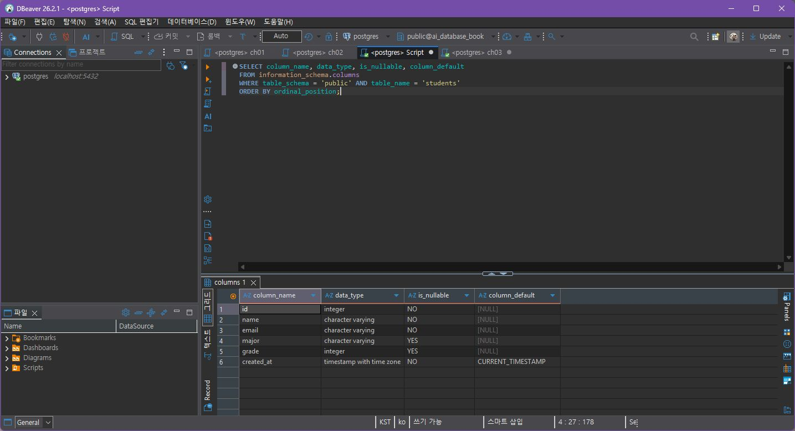
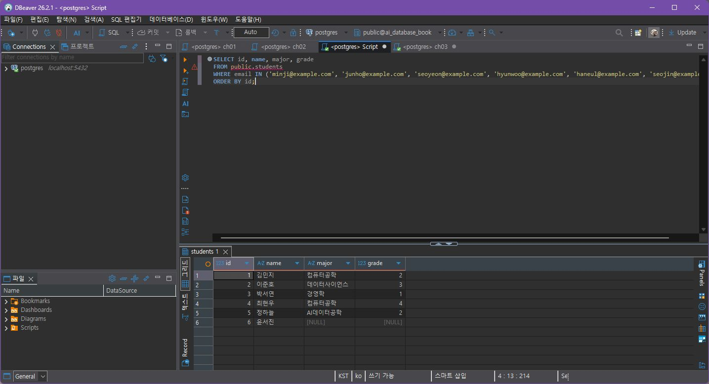
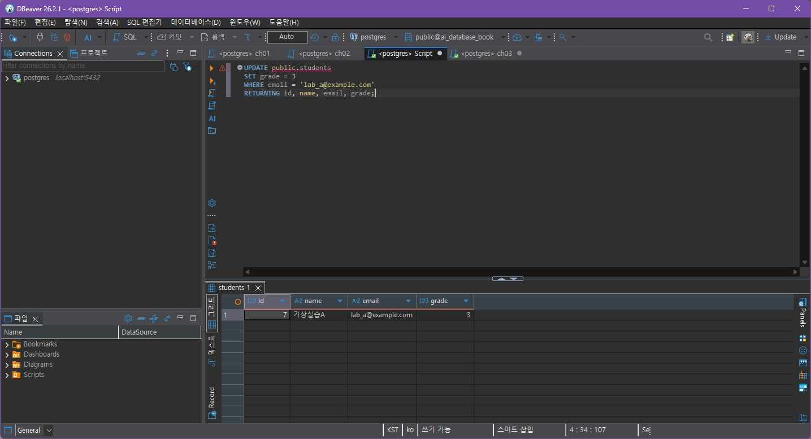
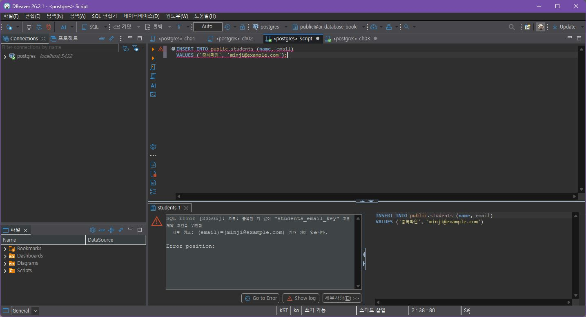

# Chapter 04 확장 실습 답안

> **과제:** 관계형 데이터베이스와 SQL 시작하기  
> **사용 방법:** 이 파일을 내려받아 본인의 GitHub 저장소에 `chapter04_answer.md`라는 이름으로 저장한 뒤 실습하면서 바로 작성합니다.  
> **제출 방법:** LMS에는 파일을 직접 업로드하지 않고, **본인 GitHub 저장소의 `chapter04_answer.md` 파일 URL**을 제출합니다.

---

## 제출 전 주의

이 파일과 캡처 화면에는 실제 비밀번호, 전체 DB 접속 URL, API Key, 개인정보를 기록하지 않습니다.

```text
GitHub 계정 또는 별칭: (미기재)
과제 작성일: 2026-10-06
사용한 AI 도구: ChatGPT (Codex) — 실습 진행과 SQL 확인에 도움을 받음
```

---

# 1. 실습 환경과 시작 상태 확인

다음을 실행합니다.

```sql
SELECT current_database();
SELECT current_user;
SELECT current_schema();
SHOW search_path;
SHOW transaction_read_only;
```

| 확인 항목 | 실제 결과 | 의미 |
| --- | --- | --- |
| current_database() | `ai_database_book` | 실습용 DB에 연결됨 |
| current_user | `postgres` | 현재 접속 계정 |
| current_schema() | `public` | 기본 스키마 |
| search_path | `public, "User"` | public을 먼저 찾음 |
| transaction_read_only | `off` | 읽기 전용 연결이 아님 |

- ✓ 현재 DB가 `ai_database_book`이다.
- ✓ 변경 가능한 연결인지 확인했다.
- ✓ 실행할 SQL 범위를 확인했다.
- ✓ Auto-commit 상태를 확인했다. (DBeaver 상단 `Auto`)

### 변경 SQL을 실행하기 전에 현재 DB와 실행 범위를 확인해야 하는 이유

```text
다른 데이터베이스에 잘못 실행하는 걸 막으려고 확인했다. Auto-commit이라 실행한 문장이 바로 반영되는 것도 확인했다.
```

---

# 2. `public.students` 구조 생성

## 2-1. 실행 전 예상

```text
테이블 이름: public.students
한 행의 의미: 학생 한 명
예상 행 수: 생성 직후 0행
기본키: id
필수 열: name, email, created_at
중복을 막는 열: email
자동 생성 열: id (IDENTITY), created_at (기본 시각)
```

## 2-2. 실행 파일

```text
code/chapter04/01_create_students.sql의 테이블 정의를 DBeaver에서 실행
```

## 2-3. 실행 후 확인

```text
테이블 생성 성공 여부: 성공
실제 행 수: 생성 직후 0행 (이후 실습으로 데이터 입력)
DBeaver에서 확인한 위치: public.students의 information_schema.columns 조회 결과
```

### 각 열의 역할

| 열 | 타입 | NULL 가능? | 역할 |
| --- | --- | --- | --- |
| id | INTEGER IDENTITY | 아니오 | 행 구분용 기본키 |
| name | VARCHAR(50) | 아니오 | 학생 이름 |
| email | VARCHAR(100) | 아니오 | 이메일, 중복 불가 |
| major | VARCHAR(100) | 예 | 전공 |
| grade | INTEGER | 예 | 학년 |
| created_at | TIMESTAMPTZ | 아니오 | 입력하지 않으면 현재 시각 |

### `id`를 학번이나 학생 수로 해석하면 안 되는 이유

```text
id는 행을 구분하려고 자동으로 붙는 번호다. 삭제되거나 입력이 실패하면 중간 번호가 비어도 학생 수와 같다는 뜻은 아니다.
```

### 증거 화면

권장 경로:

```text
assignments/chapter04/images/step02_table.png
```



---

# 3. 샘플 데이터 6명 입력

## 3-1. 실행 전 예상

```text
현재 행 수: 0
실행 후 예상 행 수: 6
예상되는 NULL 포함 학생: 윤서진 (major, grade)
```

## 3-2. 실행 파일

```text
code/chapter04/02_insert_students.sql의 샘플 입력을 실행
```

## 3-3. 실제 결과

```text
실제 행 수: 6
이준호 grade: 3
박서연 존재 여부: 있음 (1행)
윤서진 major: NULL
윤서진 grade: NULL
```

### 예상과 실제 비교

```text
학생 6명이 입력됐고 위 기준 상태와 같았다.
```

### `created_at` 값이 여러 행에서 같을 수 있는 이유

```text
CURRENT_TIMESTAMP는 트랜잭션이 시작된 시각을 사용한다. 한 트랜잭션에서 넣은 행은 같은 시각으로 보일 수 있다.
```

---

# 4. SELECT 복습과 결과 검증

각 문제는 **SQL 실행 전에 예상 행 수를 먼저 작성**합니다. 예상값은 기준 6명 데이터에서 조건별로 셌고, 아래에는 실제 결과와 함께 정리했습니다.

| 번호 | 조회 문제 | 예상 행 수 | 실제 행 수 | 일치? | 다르면 이유 |
| ---: | --- | ---: | ---: | --- | --- |
| 1 | 전체 학생 | 6 | 6 | 예 | - |
| 2 | 이름·이메일만 조회 | 6 | 6 | 예 | - |
| 3 | 특정 전공: 컴퓨터공학 | 2 | 2 | 예 | - |
| 4 | 특정 학년 이상: 3학년 이상 | 2 | 2 | 예 | - |
| 5 | 컴퓨터공학 또는 데이터사이언스 | 3 | 3 | 예 | - |
| 6 | `grade IS NULL` | 1 | 1 | 예 | - |
| 7 | `major`의 고유 값 (NULL 제외) | 4 | 4 | 예 | - |
| 8 | 학년 오름차순 상위 3명 | 3 | 3 | 예 | - |

## 4-1. 내가 직접 작성한 SQL 2개

```sql
SELECT id, name
FROM public.students
WHERE name LIKE '%하늘%';
```

```text
이 SQL의 한 행 의미: 이름에 '하늘'이 들어간 학생 한 명
예상 행 수: 1
실제 행 수: 1
```

```sql
SELECT id, name, major
FROM public.students
WHERE major IS NOT NULL
ORDER BY major, id;
```

```text
이 SQL의 한 행 의미: 전공이 입력된 학생 한 명
예상 행 수: 5
실제 행 수: 5
```

## 4-2. `= NULL` 대신 `IS NULL`을 사용하는 이유

```text
NULL은 값이 정해지지 않은 상태라서 =로 비교해도 참/거짓이 나오지 않는다. 그래서 IS NULL로 확인한다.
```

## 4-3. `ORDER BY` 없이 결과 순서를 믿으면 안 되는 이유

```text
정렬 조건이 없으면 DB가 보여주는 순서는 보장되지 않는다. 원하는 순서가 있으면 ORDER BY를 써야 한다.
```

## 4-4. `DISTINCT`가 원본 데이터를 삭제하는 기능인가요?

```text
아니다. 조회 결과에서 같은 값이 반복되는 것을 한 번만 보여준다. 원본 행은 그대로 있다.
```

### 증거 화면

권장 경로:

```text
assignments/chapter04/images/step04_select.png
```



---

# 5. 내 가상 학생 2명 추가

실명·실제 이메일 대신 가상 데이터를 사용합니다.

## 5-1. 실행 전 계획

```text
학생 A
이름: 가상실습A
이메일: lab_a@example.com
전공: 데이터과학
학년: 2

학생 B
이름: 가상실습B
이메일: lab_b@example.com
전공: 인공지능
학년 또는 NULL: NULL

현재 행 수: 6
추가 후 예상 행 수: 8
```

## 5-2. 내가 실행한 INSERT

```sql
INSERT INTO public.students (name, email, major, grade)
VALUES
    ('가상실습A', 'lab_a@example.com', '데이터과학', 2),
    ('가상실습B', 'lab_b@example.com', '인공지능', NULL)
RETURNING id, name, email, major, grade;
```

## 5-3. 실제 결과

```text
RETURNING 또는 확인 SELECT 결과: id 7 가상실습A, id 8 가상실습B
실제 전체 행 수: 8
예상과 일치 여부: 일치
```

### 내가 일부 값을 NULL로 둔 이유 또는 NULL을 사용하지 않은 이유

```text
가상실습B의 학년을 모르는 상태로 두는 경우를 연습하려고 NULL로 입력했다.
```

---

# 6. 안전한 UPDATE

내가 추가한 가상 학생 한 명만 수정합니다.

## 6-1. 먼저 대상 확인 SELECT

```sql
SELECT id, name, email, grade
FROM public.students
WHERE email = 'lab_a@example.com';
```

```text
예상 대상 행 수: 1
실제 대상 행 수: 1 (id 7)
```

## 6-2. UPDATE

```sql
UPDATE public.students
SET grade = 3
WHERE email = 'lab_a@example.com'
RETURNING id, name, email, grade;
```

```text
예상 영향 행 수: 1
실제 영향 행 수: 1
RETURNING 결과: 가상실습A, lab_a@example.com, grade 3
```

## 6-3. UPDATE 후 재조회

```sql
SELECT id, name, email, grade
FROM public.students
WHERE email = 'lab_a@example.com';
```

### `WHERE` 없는 UPDATE를 실행하면 위험한 이유

```text
대상 조건이 없어서 모든 학생의 grade가 바뀔 수 있다. 그래서 실행하지 않고, 먼저 같은 WHERE 조건으로 대상이 몇 행인지 봐야 한다.
```

### 증거 화면

권장 경로:

```text
assignments/chapter04/images/step06_update.png
```



---

# 7. 안전한 DELETE

내가 추가한 가상 학생 한 명을 삭제합니다.

## 7-1. 삭제 전 확인

```sql
SELECT id, name, email, major, grade
FROM public.students
WHERE email = 'lab_b@example.com';
```

```text
예상 대상 행 수: 1
실제 대상 행 수: 1 (id 8)
```

## 7-2. DELETE

```sql
-- 삭제 실행 전 확인 대기 중
```

```text
예상 영향 행 수: 1
실제 영향 행 수: 아직 실행하지 않음
RETURNING 결과: 아직 없음
```

## 7-3. 삭제 후 재조회

```sql
-- DELETE 실행 뒤 같은 조건으로 다시 조회 예정
```

```text
삭제 후 같은 조건의 SELECT 결과 행 수: 아직 확인 전
```

### `DELETE` 성공 메시지만 보고 끝내지 않고 다시 SELECT해야 하는 이유

```text
의도한 행 하나가 실제로 사라졌는지 확인하고, 다른 행까지 지워지지 않았는지 확인해야 한다.
```

---

# 8. 본문 기준 UPDATE·DELETE 상태 검증

`04_update_delete_students.sql`을 본문 시작 상태에서 실행했다면 다음을 확인합니다.

```text
최종 학생 수: UPDATE 이후 현재 8행 (가상 학생 2명 포함)
이준호 grade: 4
박서연 존재 여부: 있음
```

본문 기준 기대 상태와 비교합니다.

```text
학생 수 = 5
이준호 grade = 4
박서연 = 0행
```

### 내 실제 결과가 기준과 다르다면 원인

```text
이준호 UPDATE는 실행했다. 본문 파일은 학생이 정확히 6명인 시작 상태를 검사하므로 가상 학생이 남아 있는 현재는 전체 파일 실행 대상이 아니다. 가상 학생 삭제 확인 뒤 박서연 삭제를 이어서 확인할 예정이다.
```

---

# 9. 의도한 실패 2개 관찰

> 실패 테스트는 데이터베이스 규칙이 실제로 데이터를 보호하는지 확인하는 실험입니다.

## 9-1. 중복 이메일 `UNIQUE` 오류

내가 사용한 SQL:

```sql
INSERT INTO public.students (name, email)
VALUES ('중복확인', 'minji@example.com');
```

```text
오류 메시지 핵심 단서: SQL Error [23505], students_email_key 위반
왜 실패해야 맞는가: 이미 쓰는 이메일을 다시 입력했기 때문
어떤 규칙이 작동했는가: email UNIQUE
실패 후 기존 데이터가 어떻게 유지되었는가: 기존 김민지 행은 그대로 있음
```

## 9-2. 이름 `NULL` 입력 `NOT NULL` 오류

내가 사용한 SQL:

```sql
INSERT INTO public.students (name, email)
VALUES (NULL, 'null_name@example.com');
```

```text
오류 메시지 핵심 단서: SQL Error [23502], name의 NULL 값이 NOT NULL 제약조건을 위반
왜 실패해야 맞는가: name은 필수 값으로 정했기 때문
어떤 규칙이 작동했는가: name NOT NULL
```

### 실패한 INSERT 뒤 자동 생성 `id` 번호에 빈 구간이 생길 수 있어도 문제라고 단정할 수 없는 이유

```text
실패한 입력도 번호를 먼저 가져간 뒤 취소될 수 있다. id는 학생 수나 연속 번호를 뜻하지 않아 중간 번호가 비어도 데이터 오류는 아니다.
```

### 증거 화면

권장 경로:

```text
assignments/chapter04/images/step09_constraint_error.png
```



---

# 10. `verify_students.sql`로 최종 상태 확인

실행 파일:

```text
code/chapter04/verify_students.sql에 있는 핵심 상태 조회와 같은 SELECT를 실행
```

```text
현재 전체 학생 수: 8
NULL 개수: major 1개, grade 2개
이준호 grade: 4
박서연 존재 여부: 있음
현재 데이터 상태에서 예상과 다른 부분: 아직 가상 학생 B와 박서연 삭제 전이라 기준 5명 상태가 아님
```

### 검증 SQL을 따로 두면 좋은 이유

```text
작업한 뒤 행 수와 중요한 값이 맞는지 한 번에 확인할 수 있다.
```

---

# 11. AI를 SQL 작성자가 아니라 검토자로 활용

먼저 본인이 SQL을 작성한 뒤 AI에게 검토를 요청합니다.

## 11-1. 내가 작성한 SQL

```sql
UPDATE public.students
SET grade = 3
WHERE email = 'lab_a@example.com'
RETURNING id, name, email, grade;
```

## 11-2. AI에게 전달한 핵심 요청

```text
이 UPDATE의 WHERE 조건이 한 학생만 가리키는지, 실행 전 확인할 SELECT와 실행 후 확인 방법을 봐 달라고 요청했다.
```

## 11-3. AI 검토 결과

| AI 제안 | 수용 / 수정 / 거절 | 실제 검증 결과 | 나의 이유 |
| --- | --- | --- | --- |
| UPDATE 전에 같은 이메일로 SELECT | 수용 | 1행이 나옴 | 대상 확인에 필요함 |
| RETURNING으로 바뀐 행 확인 | 수용 | 1행, grade 3 | 수정 결과를 바로 볼 수 있었음 |
| UPDATE 뒤 같은 조건으로 SELECT | 수용 | id 7, grade 3 | 최종 값까지 확인함 |

### AI가 예상한 영향 행 수와 실제 결과가 같았나요?

```text
같았다. 예상 1행이었고 실제 RETURNING도 1행이었다.
```

### AI 답변을 실행 전에 검토해야 하는 이유

```text
WHERE가 빠지거나 조건이 넓으면 원하지 않은 여러 행이 바뀔 수 있다. 먼저 실제 대상 행을 확인해야 한다.
```

---

# 12. 내 서비스 테이블 하나 확장 설계

Chapter 01~03에서 정한 개인 서비스에서 **테이블 하나**를 선택합니다.

```text
서비스 이름: AI 튜터링 질문 관리 서비스
테이블 이름: questions
한 행의 의미: 학생이 등록한 질문 하나
```

| 열 이름 | 저장할 값 | 타입 후보 | NULL 가능? | UNIQUE 후보? | 이유 |
| --- | --- | --- | --- | --- | --- |
| question_id | 질문 식별 번호 | BIGINT | 아니오 | 예 | 기본키 후보 |
| student_id | 질문을 쓴 학생 번호 | BIGINT | 아니오 | 아니오 | 학생과 연결할 값 |
| question_text | 질문 내용 | TEXT | 아니오 | 아니오 | 질문 원문 |
| status | 질문 처리 상태 | VARCHAR(30) | 아직 미정 | 아니오 | 상태 종류를 정해야 함 |
| created_at | 등록 시각 | TIMESTAMPTZ | 아니오 | 아니오 | 등록 시간 확인 |

```text
PK 후보: question_id
업무 식별자 후보: 현재 정하지 않음
아직 미확정인 규칙: status의 허용 값, 질문 수정 가능 여부, 학생 삭제 시 질문 처리 방법
```

## 선택: CREATE TABLE 초안

> 아직 확정되지 않은 업무 규칙은 억지로 제약조건으로 만들지 않습니다.

```sql
CREATE TABLE questions (
    question_id BIGINT GENERATED BY DEFAULT AS IDENTITY PRIMARY KEY,
    student_id BIGINT NOT NULL,
    question_text TEXT NOT NULL,
    status VARCHAR(30),
    created_at TIMESTAMPTZ NOT NULL DEFAULT CURRENT_TIMESTAMP
);
```

### AI에게 검토받은 뒤 수정한 부분

```text
status 값은 아직 정해지지 않아 CHECK나 NOT NULL을 추가하지 않았다. 학생 테이블과 연결하는 외래키는 다음 장에서 관계를 정한 뒤 추가하는 편이 맞다고 확인했다.
```

---

# 13. 최종 성찰

아래 문장은 본인의 말로 작성합니다.

```text
1. SQL 실행 성공과 올바른 대상 선택이 다른 이유는
   문법이 맞아도 엉뚱한 행을 바꿀 수 있기 때문이다.

2. UPDATE와 DELETE 전에 SELECT를 먼저 해야 하는 이유는
   조건에 맞는 행이 몇 개인지 먼저 볼 수 있기 때문이다.

3. 영향받은 행 수를 확인해야 하는 이유는
   예상보다 많이 바뀌거나 적게 바뀐 것을 바로 알 수 있기 때문이다.

4. UNIQUE 또는 NOT NULL 오류를 '보호 장치가 정상 동작한 결과'라고 볼 수 있는 이유는
   중복 이메일과 필수 이름 누락을 DB가 막아 줬기 때문이다.

5. AI가 SQL을 만들어 주더라도 내가 반드시 확인해야 하는 것은
   WHERE 조건과 실제 대상 행, 실행 뒤 결과다.
```

---

# 14. 제출 체크리스트

- ✓ `chapter04_answer.md`를 본인 저장소의 Chapter 04 폴더에 만들었다.
- ✓ 현재 DB와 실행 환경을 확인했다.
- ✓ `public.students`를 생성했다.
- ✓ 샘플 6명 입력 결과를 검증했다.
- ✓ SELECT 문제의 실제 행 수를 확인했다.
- ✓ 가상 학생 2명을 추가했다.
- ✓ UPDATE 전후를 SELECT로 확인했다.
- ○ DELETE 전후를 확인 중이다.
- ✓ UNIQUE 오류를 관찰했다.
- ✓ NOT NULL 오류를 관찰했다.
- ○ `verify_students.sql` 최종 상태를 다시 확인할 예정이다.
- ✓ AI 검토를 실제 SQL 결과와 비교했다.
- ✓ 개인 서비스 테이블 하나를 확장 설계했다.
- ✓ 핵심 캡처 4장을 답안에 넣었다.
- ✓ 비밀번호·실제 개인정보가 캡처에 없다.
- ○ GitHub 웹에서 Markdown 이미지 렌더링을 확인하지 않았다.
- ○ commit/push는 아직 하지 않았다.

---

# 15. LMS 제출 URL

아래 형식의 **본인 GitHub 파일 URL**을 LMS에 제출합니다.

```text
https://github.com/<본인-GitHub-ID>/<본인-저장소>/blob/main/assignments/chapter04/chapter04_answer.md
```

내 제출 URL:

```text
아직 없음 (로컬 작성본)
```

> 교수자 템플릿 URL이나 저장소 메인 URL이 아니라 **작성 완료된 본인 `chapter04_answer.md` 파일 화면 URL**을 제출합니다.


