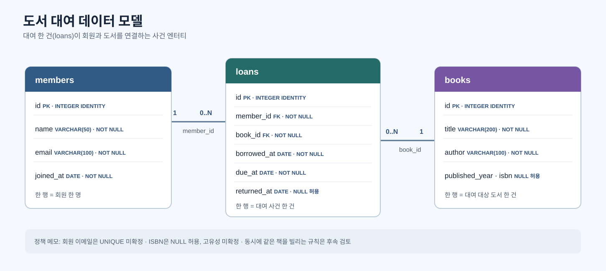
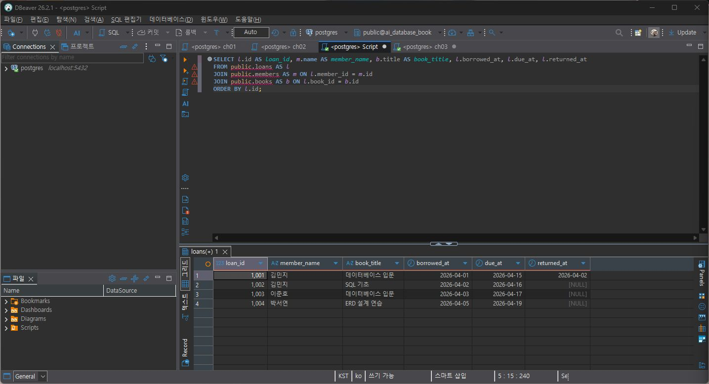
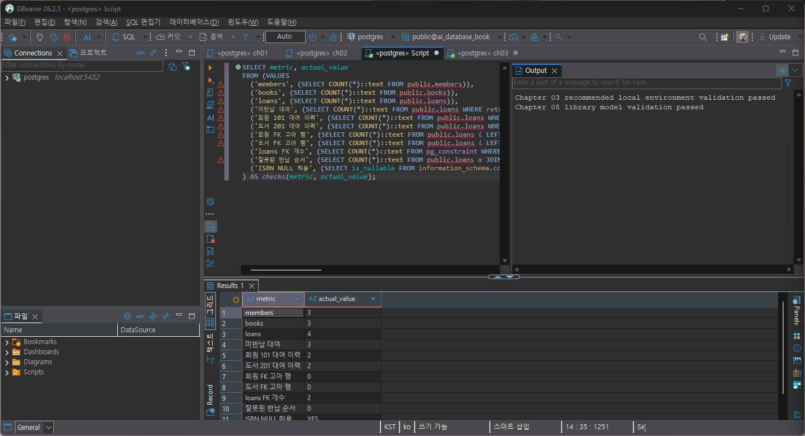
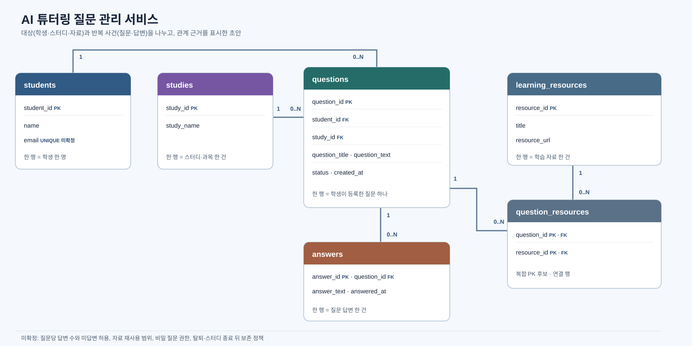

# Chapter 05 확장 실습 답안

> 과제: 요구사항에서 데이터 모델과 ERD 만들기

```text
GitHub 계정 또는 별칭: pang789789
과제 작성일: 2026-10-06
사용한 AI 도구: ChatGPT (Codex) — SQL 실행 확인과 ERD 검토에 도움
```

---

# 1. Chapter 05 핵심 개념 복습

```text
요구사항에서 바로 테이블부터 만들면 위험한 이유:
저장할 대상과 사건, 관계가 정리되기 전에 테이블을 만들면 같은 사실이 여러 곳에 저장되거나 필요한 이력이 빠질 수 있다.

한 행의 의미를 먼저 정해야 하는 이유:
한 행이 무엇을 나타내는지 알아야 열과 키, 관계를 알맞게 정할 수 있다.

확정 요구사항과 미확정 정책을 구분해야 하는 이유:
요구사항에 없는 규칙을 미리 정하면 실제 업무와 다른 제한을 데이터베이스에 넣을 수 있다.

PK와 업무상 고유값 후보의 차이:
PK는 데이터베이스에서 행을 구분하는 키이고, 이메일이나 ISBN 같은 값은 업무 규칙이 확인되어야 고유값으로 정할 수 있다.

N:M 관계를 그대로 두지 않고 연결 테이블을 검토하는 이유:
양쪽이 여러 건씩 연결되면 한 행에 여러 ID를 넣지 않고 연결 테이블로 관계를 나누어 저장한다. 대여처럼 관계 자체의 날짜도 기록할 수 있다.
```

---

# 2. 도서 대여 요구사항 R-01~R-07 다시 분해

| 요구사항 | 관리 대상 / 사건 | 속성 후보 | 관계 / 규칙 후보 | 미확정 질문 |
| --- | --- | --- | --- | --- |
| R-01 | 회원 | 회원 식별자 | 도서관이 회원을 관리한다 | 탈퇴 후 기록을 보존하는가? |
| R-02 | 회원 | 이름, 이메일, 가입일 | 회원 정보에 필요한 값 | 이메일이 고유해야 하는가? |
| R-03 | 도서 | 제목, 저자, 출판연도, ISBN | 출판연도와 ISBN은 저장할 수 있다 | ISBN이 없거나 저자가 여럿인 도서는 어떻게 다루는가? |
| R-04 | 대여 사건 | 회원 ID, 도서 ID | 회원은 여러 도서를 대여할 수 있다 | 최대 대여 권수는 얼마인가? |
| R-05 | 대여 사건 | 대여 ID, 대여일 | 같은 도서도 시간에 따라 여러 번 대여될 수 있다 | 실물 복본을 따로 식별하는가? |
| R-06 | 대여 사건 | 대여일, 반납예정일, 실제반납일 | 실제반납일은 대여 후 기록한다 | 연체료를 관리하는가? |
| R-07 | 미반납 대여 | 실제반납일 NULL | 아직 반납하지 않았으면 실제반납일이 비어 있을 수 있다 | 동시 대여를 어떤 규칙으로 막는가? |

### 본문과 비교한 뒤 수정한 내용

```text
처음에 놓친 부분: 대여는 회원과 도서를 연결하는 것에서 끝나지 않고 날짜가 있는 사건이다.

처음에 잘못 분류한 부분: ISBN을 항상 있어야 하는 고유 식별값처럼 생각할 수 있었다.

수정한 이유: 요구사항은 ISBN을 저장할 수 있다고만 했고, 없음 허용 여부와 고유성은 확정하지 않았다.
```

---

# 3. 확정 규칙과 미확정 정책 구분

## 3-1. 확정된 규칙

```text
1. 회원과 도서를 관리한다.
2. 한 대여 기록은 회원 한 명과 도서 한 건을 참조한다.
3. 회원은 여러 대여 기록을 가질 수 있다.
4. 대여 기록에는 대여일과 반납예정일이 있다.
5. 아직 반납하지 않은 대여는 실제반납일이 비어 있을 수 있다.
```

## 3-2. 미확정 질문

```text
Q1. 회원 이메일은 중복될 수 있는가?
Q2. ISBN이 없는 도서도 등록할 수 있는가?
Q3. 같은 ISBN의 실물 책 여러 권을 각각 식별해야 하는가?
Q4. 한 도서에 공동 저자가 여러 명일 수 있는가?
Q5. 회원 한 명이 빌릴 수 있는 도서 수에 제한이 있는가?
Q6. 같은 도서를 두 회원이 동시에 빌릴 수 있는가?
Q7. 회원을 삭제해도 과거 대여 이력을 보존해야 하는가?
```

### 미확정 정책을 바로 `UNIQUE`, `CHECK`, 삭제 규칙으로 구현하면 위험한 이유

```text
현재 규칙으로 정해지지 않은 내용을 제약조건으로 고정하면 유효한 자료 입력을 막거나 보존해야 할 이력을 지울 수 있다. 업무 정책을 먼저 확인한 뒤 제약조건을 정해야 한다.
```

---

# 4. 엔터티·속성·사건 후보 구분

| 후보 | 대상 엔터티 / 사건 엔터티 / 속성 | 판단 근거 | 독립 식별 필요? |
| --- | --- | --- | --- |
| 회원 | 대상 엔터티 | 이름, 이메일, 가입일을 가진 관리 대상 | 필요. `members.id` |
| 도서 | 대상 엔터티 | 제목과 저자 등 도서 정보를 관리 | 필요. `books.id` |
| 대여 기록 | 사건 엔터티 | 대여가 반복되고 대여일·반납일이 붙는다 | 필요. `loans.id` |
| 이메일 | 속성 | 회원의 연락 정보 후보 | 현재는 별도 식별 불필요. 고유성 미확정 |
| ISBN | 속성 | 도서에 붙을 수 있는 번호 | 현재는 별도 식별 불필요. NULL 및 고유성 정책 미확정 |
| 반납예정일 | 속성 | 대여 사건에 속하는 날짜 | 별도 식별 불필요 |

### “명사가 보이면 무조건 테이블”이 아닌 이유

```text
명사라도 다른 행을 식별하거나 독립적으로 관리할 필요가 없는 값이면 속성일 수 있다. 대여 기록처럼 자체 날짜와 반복 이력이 있는 사건은 별도 행으로 두어야 한다.
```

---

# 5. 테이블별 한 행의 의미와 키 후보

| 테이블 | 한 행의 의미 | PK 후보 | 업무상 고유값 후보 | FK 후보 |
| --- | --- | --- | --- | --- |
| `members` | 회원 한 명 | `id` | `email` 후보, 고유성 미확정 | 없음 |
| `books` | 대여 대상 도서 항목 한 건 | `id` | `isbn` 후보, 고유성 미확정 | 없음 |
| `loans` | 회원 한 명이 도서 한 건을 대여한 사건 한 건 | `id` | 현재 확정된 후보 없음 | `member_id`, `book_id` |

### `members.email`을 지금 바로 UNIQUE라고 확정하지 않는 이유

```text
요구사항에는 이메일이 회원 정보라고 되어 있지만, 중복을 허용하지 않는다는 규칙은 없다. 현재 실습 스키마도 UNIQUE를 적용하지 않았다.
```

### `books.isbn`을 지금 바로 NOT NULL + UNIQUE라고 확정하지 않는 이유

```text
요구사항은 ISBN을 저장할 수 있다고 했다. ISBN이 없는 도서 가능성과 중복 ISBN 처리 방식이 정해지지 않아 실습 구조는 NULL과 중복을 허용한다.
```

---

# 6. 관계를 양방향 문장으로 작성

## 6-1. `members ↔ loans`

```text
회원 한 명은 대여 기록을 0건 이상 가질 수 있다.

대여 기록 한 건은 정확히 한 회원을 참조한다.

카디널리티: members 1 : N loans
선택성에서 확인할 점: 회원만 등록하고 대여하지 않은 상태도 가능하다. 대여 기록에는 회원 ID가 필요하다.
```

## 6-2. `books ↔ loans`

```text
도서 한 건은 시간에 따라 대여 기록을 0건 이상 가질 수 있다.

대여 기록 한 건은 정확히 한 도서를 참조한다.

카디널리티: books 1 : N loans
선택성에서 확인할 점: 아직 한 번도 대여되지 않은 도서도 등록할 수 있다. 대여 기록에는 도서 ID가 필요하다.
```

## 6-3. `members ↔ books`를 직접 N:M으로 저장하지 않고 `loans`를 두는 이유

```text
한 회원이 여러 도서를 빌리고, 한 도서도 시간에 따라 여러 회원에게 대여될 수 있다. `loans`를 두면 이 관계와 각 대여 날짜를 함께 저장할 수 있다.
```

### `loans`가 단순 연결표가 아니라 사건 엔터티라고 볼 수 있는 이유

```text
`loans` 한 행은 실제 대여 사건 한 건이다. 회원 ID와 도서 ID뿐 아니라 대여일, 반납예정일, 실제반납일을 가진다.
```

---

# 7. 도서 대여 ERD 초안



### ERD를 그린 뒤 수정한 부분

```text
처음부터 이메일과 ISBN을 고유키로 두지 않고 내부 id를 PK로 표시했다. 대여 기록은 회원·도서의 FK와 날짜를 가진 별도 사건 엔터티로 정리했다.
```

---

# 8. PostgreSQL로 도서 대여 모델 구현 확인

## 8-1. 현재 환경 확인

```sql
SELECT current_database();
SELECT current_user;
SELECT current_schema();
SHOW search_path;
SHOW transaction_read_only;
```

```text
현재 DB: ai_database_book
현재 사용자: postgres
현재 스키마: public
search_path: public, "User"
읽기 전용 여부: off
```

- ✓ 현재 DB가 `ai_database_book`이다.
- ✓ 실행 범위를 확인했다.
- ✓ Auto-commit 상태를 확인했다. DBeaver 도구 모음에 `Auto`가 표시됐다.

## 8-2. 스키마 생성 SQL 실행

사용 파일:

```text
code/chapter05/01_library_schema.sql
```

실행 전 예상:

```text
생성될 테이블 수: 3개
생성 순서: members → books → loans
각 테이블 예상 행 수: members 0, books 0, loans 0
```

실행 후 실제:

```text
members 존재: 예
books 존재: 예
loans 존재: 예
각 테이블 행 수: 실행 직후 각각 0행
실행 결과: 오류 없이 3개 테이블 생성 확인
```

### `loans`를 마지막에 만드는 이유

```text
`loans.member_id`가 `members.id`를, `loans.book_id`가 `books.id`를 참조한다. 두 부모 테이블이 먼저 있어야 외래키를 연결할 수 있다.
```

---

# 9. 샘플 데이터 입력과 관계 관찰

사용 파일:

```text
code/chapter05/02_library_seed.sql
```

## 9-1. 실행 전 예상

```text
members 예상 행 수: 3
books 예상 행 수: 3
loans 예상 행 수: 4
미반납 예상 건수: 3
회원 101 대여 예상 건수: 2
도서 201 대여 예상 건수: 2
```

## 9-2. 실제 결과

```text
members 실제 행 수: 3
books 실제 행 수: 3
loans 실제 행 수: 4
미반납 실제 건수: 3
회원 101 대여 실제 건수: 2
도서 201 대여 실제 건수: 2
```

### 샘플 데이터에서 확인한 1:N 관계

```text
회원 101은 대여 기록 1001과 1002를 가진다. 도서 201도 대여 기록 1001과 1003에 연결된다. 같은 ID가 여러 대여 행에 나오는 것은 각각 다른 대여 사건이기 때문이다.
```

### `returned_at = NULL`이 의미하는 것

```text
실제 반납일이 아직 기록되지 않은 상태다. 이번 결과에서는 대여 1002, 1003, 1004의 returned_at이 NULL이었다.
```

### 증거 화면



---

# 10. 검증 SQL 실행

사용 파일:

```text
code/chapter05/03_library_validation.sql
```

## 10-1. 결과 기록

```text
members = 3
books = 3
loans = 4
미반납 건수 = 3
회원 101 대여 이력 = 2
도서 201 대여 이력 = 2
회원 참조 고아 행 = 0
도서 참조 고아 행 = 0
loans FK 개수 = 2
검증 최종 메시지 = Chapter 05 library model validation passed
```

추가로 실행 결과에서 `잘못된 반납 순서 = 0`, `ISBN NULL 허용 = YES`도 확인했다.

### 단순히 테이블 3개가 생성되었다고 설계 검증이 끝난 것이 아닌 이유

```text
테이블 존재 여부만으로는 FK가 맞게 연결됐는지, 대여 관계가 저장됐는지, 고아 참조가 있는지 알 수 없다. 샘플 데이터와 검증 쿼리까지 확인해야 한다.
```

### 증거 화면



---

# 11. 작은 시나리오로 모델 검증

| 시나리오 | 표현 가능? | 이유 | 추가 확인할 정책 |
| --- | --- | --- | --- |
| 회원 A가 서로 다른 책 2권을 대여 | 가능 | 회원 ID가 다른 loans 행에 반복될 수 있다 | 최대 대여 권수 |
| 같은 책을 시간 차를 두고 다시 대여 | 가능 | 같은 book_id를 서로 다른 대여 기록에서 참조할 수 있다 | 이전 대여 반납 후 재대여 규칙 |
| 아직 반납하지 않은 대여 | 가능 | `returned_at`을 NULL로 둘 수 있다 | 연체 상태 계산 방식 |
| 회원은 있지만 대여 기록이 없음 | 가능 | 회원 등록에 대여 행이 필수는 아니다 | 없음 |
| ISBN이 없는 도서 | 가능 | `books.isbn`은 NULL을 허용한다 | ISBN 미등록 사유를 구분할지 |
| 같은 ISBN의 실물 복본 2권 | 제한적 | ISBN 중복 입력은 되지만 실물 복본을 구별할 별도 키가 없다 | 실물 책 단위 관리 여부 |
| 한 도서에 저자 2명 | 현재 구조로 어려움 | `books.author`는 저자 한 명을 저장하는 문자열 열이다 | 공동 저자를 별도 엔터티로 관리할지 |
| 같은 도서를 두 명이 동시에 대여 | 현재 스키마만으로 막지 못함 | 동시 미반납 대여를 제한하는 제약이나 트리거가 없다 | 동시 대여 금지 및 복본 단위 정책 |

### 현재 Chapter 05 모델의 한계 3가지

```text
1. 같은 ISBN의 실물 복본을 구분하는 테이블이 없다.
2. books.author는 한 명의 저자 값만 담는 구조다.
3. 같은 도서에 미반납 대여가 동시에 생기는 것을 막는 업무 규칙이 구현되어 있지 않다.
```

---

# 12. Chapter 01~04 개인 서비스 요구사항 작성

```text
서비스 이름: AI 튜터링 질문 관리 서비스
서비스 목적: 학생의 질문과 튜터 답변, 관련 학습 자료를 관리하고 질문 데이터를 살펴본다.
```

## 12-1. 요구사항

```text
P05-R01. 학생 정보를 관리한다.
P05-R02. 학생은 학습 중 여러 질문을 작성할 수 있다.
P05-R03. 질문 한 건은 질문을 작성한 학생 한 명과 연결된다.
P05-R04. 질문 한 건에는 튜터 답변이 연결될 수 있다.
P05-R05. 질문과 튜터 답변을 별도 데이터로 저장한다.
P05-R06. 질문과 학습 자료의 연결 정보를 저장한다.
P05-R07. 학습 자료 하나가 여러 질문에 연결될 수 있는 구조를 검토한다.
P05-R08. 저장한 질문 데이터를 나중에 살펴볼 수 있도록 질문 기록을 남긴다.
```

## 12-2. 미확정 질문

```text
P05-Q01. 한 질문에 튜터가 여러 번 답변할 수 있는가?
P05-Q02. 답변이 없는 질문도 저장할 수 있는가?
P05-Q03. 같은 학습 자료를 여러 질문에 연결할 수 있는가?
P05-Q04. 질문의 공개 범위와 보존 기간은 어떻게 정하는가?
```

---

# 13. 개인 서비스 모델 초안

## 13-1. 엔터티·사건 후보표

| 후보 | 대상 / 사건 | 한 행의 의미 | 주요 속성 | PK 후보 | 업무 식별자 후보 |
| --- | --- | --- | --- | --- | --- |
| `students` | 대상 | 학생 한 명 | 이름, 이메일 후보 | `student_id` | 학번 후보, 규칙 미확정 |
| `questions` | 사건 | 학생이 작성한 질문 한 건 | `student_id`, 제목/본문 후보, 작성일 후보 | `question_id` | 없음 |
| `answers` | 사건 | 질문 한 건에 대한 튜터 답변 한 건 | `question_id`, 답변 내용, 작성일 후보 | `answer_id` | 없음 |
| `learning_resources` | 대상 | 학습 자료 한 건 | 제목, 자료 위치 후보 | `resource_id` | 자료 URL 후보, 고유성 미확정 |
| `question_resources` | 연결 엔터티 | 질문 한 건과 학습 자료 한 건의 연결 | `question_id`, `resource_id` | 복합키 후보 | 동일 질문·자료 조합 |

## 13-2. 관계 문장

```text
관계 1:
학생 한 명은 질문을 여러 건 작성할 수 있다.
질문 한 건은 작성한 학생 한 명을 참조한다.

관계 2:
질문 한 건에는 답변이 없거나 여러 답변이 연결될 수 있는 후보 구조다.
답변 한 건은 질문 한 건에 속한다. 답변 최소·최대 개수는 아직 미확정이다.

관계 3:
질문 한 건은 학습 자료 여러 건과 연결될 수 있다.
학습 자료 한 건도 질문 여러 건에서 참조될 수 있다. 정확한 정책은 확인이 필요하다.
```

## 13-3. N:M 관계 검토

```text
N:M 관계 후보: questions ↔ learning_resources
연결 테이블 후보: question_resources
연결 테이블 한 행의 의미: 특정 질문 하나와 특정 학습 자료 하나 사이의 연결
연결 테이블 자체에 필요한 사건 속성: 현재 요구사항만으로는 필수 속성이 정해지지 않았다. 연결일이나 추천 사유가 필요한지는 확인한다.
```

---

# 14. 개인 서비스 ERD 초안



### ERD의 각 테이블이 어떤 요구사항에서 나왔는지 설명

| 테이블 | 근거 요구사항 ID | 한 행의 의미 |
| --- | --- | --- |
| `students` | P05-R01, P05-R02 | 학생 한 명 |
| `questions` | P05-R02, P05-R03, P05-R08 | 학생이 작성한 질문 한 건 |
| `answers` | P05-R04, P05-R05 | 질문에 대한 튜터 답변 한 건 |
| `learning_resources` | P05-R06, P05-R07 | 학습 자료 한 건 |
| `question_resources` | P05-R06, P05-R07 | 질문과 학습 자료 사이의 연결 한 건 |

---

# 15. 요구사항 추적표

| 요구사항 ID | 데이터 모델 반영 위치 | 검증 방법 | 상태 |
| --- | --- | --- | --- |
| P05-R01 | `students` | 학생 한 행 의미와 PK 후보 확인 | 반영 |
| P05-R02 | `questions.student_id` | 학생 한 명에 질문 여러 건 연결 시나리오 | 반영 |
| P05-R03 | `questions.student_id` FK 후보 | 질문 한 건이 학생 한 명을 참조하는지 확인 | 반영 |
| P05-R04 | `answers.question_id` | 답변 없는 질문과 답변 연결 정책 확인 | 확인필요 |
| P05-R05 | `answers` | 질문과 답변을 별도 행으로 모델링 | 반영 |
| P05-R06 | `question_resources` | 질문·자료 연결 행으로 표현 | 반영 |
| P05-R07 | `question_resources` | 자료 하나를 여러 질문에 연결하는 시나리오 | 확인필요 |
| P05-R08 | `questions`의 작성일 후보 | 질문 기록을 조회하는 테스트 | 확인필요 |

### ERD 그림만으로 요구사항 누락을 발견하기 어려운 이유

```text
ERD에는 구조와 관계가 보이지만 업무 규칙이 왜 필요한지, 아직 답이 없는 정책이 무엇인지는 다 드러나지 않는다. 요구사항 ID와 테이블·검증 방법을 같이 연결해야 빠뜨린 부분을 찾기 쉽다.
```

---

# 16. 개인 서비스 작은 데이터 시나리오 검증

가상 데이터만 사용합니다.

```text
사용자/대상 A: 학생 101 김민지
사용자/대상 B: 학생 102 이준호
대상 X: SQL 기초 질문 Q-001
대상 Y: 데이터베이스 키 질문 Q-002
사건 1: 학생 101이 Q-001을 작성한다.
사건 2: 학생 101이 Q-002를 작성한다.
사건 3: 학생 102가 Q-001 관련 후속 질문 Q-003을 작성한다.
사건 4: 튜터 답변 A-001을 Q-001에 연결하고 자료 R-001을 Q-001과 Q-002에 연결한다.
```

### 이 시나리오를 현재 ERD로 저장할 수 있는가?

```text
표시한 관계만 보면 저장할 수 있다. students와 questions는 1:N이고, 답변과 학습 자료 연결은 각각 별도 테이블 후보로 분리되어 있다. 다만 실제 FK와 속성은 아직 설계 초안이다.
```

### 저장하기 어려운 상황 또는 모호한 부분

```text
답변을 여러 개 허용하는지, 답변이 없는 질문을 얼마나 유지하는지, 자료 하나를 여러 질문에 재사용해도 되는지는 업무 정책으로 확정되지 않았다.
```

### 시나리오 검증 후 수정한 ERD 내용

```text
질문과 학습 자료 사이를 직접 한 열로 연결하지 않고 question_resources 연결 엔터티로 표시했다. 한 자료를 여러 질문에 연결할 수 있는 요구가 유지될 경우를 표현할 수 있다.
```

---

# 17. AI를 설계자가 아니라 리뷰어로 활용

## 17-1. AI에게 전달한 핵심 자료

```text
요구사항: Chapter 01~03에서 정리한 AI 튜터링 질문 관리 서비스
미확정 질문: 질문당 답변 수, 답변이 없는 질문, 자료 재사용 정책
테이블별 한 행 의미: 학생 한 명, 질문 한 건, 답변 한 건, 학습 자료 한 건, 질문·자료 연결 한 건
관계 문장: 학생 1:N 질문, 질문 1:N 답변 후보, 질문 N:M 학습 자료 후보
ERD 설명: 학생·질문·답변·학습자료와 연결 엔터티를 구분한 초안
```

## 17-2. AI 검토 요청

실제로 사용한 프롬프트 또는 핵심 내용을 기록합니다.

```text
앞 장에서 정리한 AI 튜터링 질문 관리 요구사항을 기준으로 엔터티와 한 행 의미, PK/FK 후보, 관계와 N:M 연결 테이블을 검토해 달라고 요청했다. 요구사항에 없는 이메일 고유성, 답변 개수, 자료 재사용 정책은 결정하지 말고 확인 질문으로 남기도록 했다.
```

## 17-3. AI 제안 검토

| AI 제안 또는 질문 | 수용 / 수정 / 보류 / 거절 | 실제 근거 요구사항 | 나의 판단 이유 |
| --- | --- | --- | --- |
| 대여는 날짜가 있는 사건이므로 `loans`로 둔다 | 수용 | R-04~R-07 | 대여일과 반납일을 기록해야 한다 |
| 이메일을 고유하게 제한한다 | 거절 | R-02 | 이메일을 가진다는 내용만 있고 중복 금지는 없다 |
| ISBN을 필수·고유로 제한한다 | 거절 | R-03 | ISBN을 저장할 수 있다고 했을 뿐 필수·고유라고 정하지 않았다 |
| 질문과 자료는 연결 테이블 후보로 둔다 | 수용 | 기존 개인 서비스 정의와 P05-R06~R07 | 양쪽 여러 건 연결 가능성을 별도 행으로 나타낼 수 있다 |
| 질문당 답변을 하나로 고정한다 | 보류 | 기존 개인 서비스의 미확정 질문 | 답변 개수 정책을 아직 정하지 않았다 |

### AI가 요구사항에 없는 정책을 임의로 확정한 부분이 있었나요?

```text
이메일·ISBN 고유성이나 답변 개수처럼 추가로 정할 수 있는 항목이 나왔지만, 요구사항에 근거가 없어 확정하지 않고 질문으로 남겼다.
```

### AI 검토를 받고도 채택하지 않은 제안 하나와 그 이유

```text
이메일 UNIQUE는 적용하지 않았다. 회원마다 이메일이 하나씩만 있어야 한다는 업무 규칙이 확인되지 않았다.
```

---

# 18. 선택 — PostgreSQL DDL 초안

> 아래는 개인 서비스 설계 초안이며, 실제 데이터베이스에는 실행하지 않았다.

```sql
CREATE TABLE students (
    student_id INTEGER GENERATED BY DEFAULT AS IDENTITY PRIMARY KEY,
    student_number VARCHAR(30),
    name VARCHAR(100) NOT NULL,
    email VARCHAR(255)
);

CREATE TABLE questions (
    question_id INTEGER GENERATED BY DEFAULT AS IDENTITY PRIMARY KEY,
    student_id INTEGER NOT NULL REFERENCES students(student_id),
    title VARCHAR(200),
    body TEXT NOT NULL,
    created_at TIMESTAMP NOT NULL DEFAULT CURRENT_TIMESTAMP
);

CREATE TABLE answers (
    answer_id INTEGER GENERATED BY DEFAULT AS IDENTITY PRIMARY KEY,
    question_id INTEGER NOT NULL REFERENCES questions(question_id),
    body TEXT NOT NULL,
    created_at TIMESTAMP NOT NULL DEFAULT CURRENT_TIMESTAMP
);

CREATE TABLE learning_resources (
    resource_id INTEGER GENERATED BY DEFAULT AS IDENTITY PRIMARY KEY,
    title VARCHAR(200) NOT NULL,
    resource_url TEXT
);

CREATE TABLE question_resources (
    question_id INTEGER NOT NULL REFERENCES questions(question_id),
    resource_id INTEGER NOT NULL REFERENCES learning_resources(resource_id),
    PRIMARY KEY (question_id, resource_id)
);
```

### 아직 구현하지 않은 미확정 정책

```text
1. 학생 이메일 또는 학번의 고유성
2. 질문 하나에 허용할 답변 수와 답변 없는 질문의 처리
3. 자료 재사용 범위, 질문 공개 권한 및 보존·삭제 규칙
```

---

# 19. 최종 성찰

```text
1. 요구사항에서 바로 테이블을 만들지 않고 중간 설계 과정을 거쳐야 하는 이유는
   저장할 대상과 사건, 관계를 먼저 정해야 불필요한 제약이나 빠진 기록을 줄일 수 있기 때문이다.

2. 테이블의 한 행 의미가 중요한 이유는
   행마다 무엇을 나타내는지 정해야 열과 키, 관계가 분명해지기 때문이다.

3. 미확정 정책을 그대로 남겨 두는 것이 좋은 설계 활동일 수 있는 이유는
   아직 정해지지 않은 규칙을 데이터베이스에 임의로 고정하지 않을 수 있기 때문이다.

4. N:M 관계에서 연결 엔터티가 필요한 이유는
   여러 건의 연결을 행으로 표현하고 그 관계에 필요한 정보도 담을 수 있기 때문이다.

5. AI가 ERD를 만들어 주더라도 사람이 반드시 확인해야 하는 것은
   각 테이블과 관계가 실제 요구사항에 근거하는지, 미정인 규칙을 확정해 버리지는 않았는지이다.
```

---

# 20. 제출 체크리스트

- ✓ `chapter05_answer.md`를 로컬 저장소 `assignments/chapter05`에 작성했다.
- ✓ R-01~R-07을 다시 분해했다.
- ✓ 확정 규칙과 미확정 질문을 나눴다.
- ✓ `members/books/loans`의 한 행 의미와 관계를 정리했다.
- ✓ 도서 대여 ERD를 넣었다.
- ✓ `01_library_schema.sql`, `02_library_seed.sql`, `03_library_validation.sql`을 DBeaver에서 실행했다.
- ✓ 실제 행 수와 검증 메시지를 확인하고 결과 캡처를 넣었다.
- ✓ 작은 시나리오로 도서 대여 모델의 한계를 적었다.
- ✓ 개인 서비스 요구사항 8개와 미확정 질문을 작성했다.
- ✓ 개인 서비스 ERD와 추적표, 시나리오를 넣었다.
- ✓ AI 검토 내용을 요구사항 근거와 함께 기록했다.
- ✓ ERD 2장과 실행 결과 캡처 2장을 본문에 삽입했다.

GitHub commit/push와 LMS 제출 URL은 로컬 파일 작성만으로 완료되는 작업이 아니어서 이 답안에서는 완료로 표시하지 않았다.

---

# 21. LMS 제출 URL

```text
내 제출 URL: GitHub에 이 파일을 게시한 뒤 본인 저장소의 chapter05_answer.md 주소 입력
```

> 현재 답안과 이미지는 로컬 저장소에 있다. 아직 GitHub 웹에서 렌더링을 확인하거나 LMS URL을 제출한 상태는 아니다.