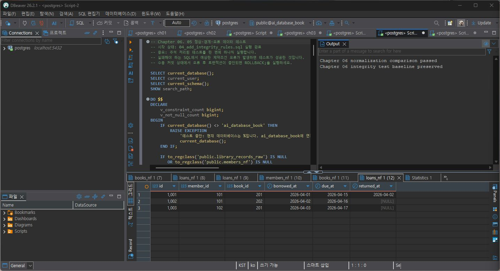
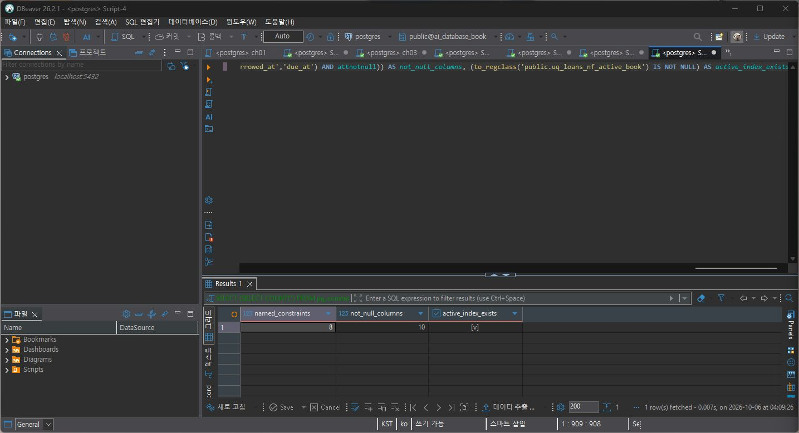
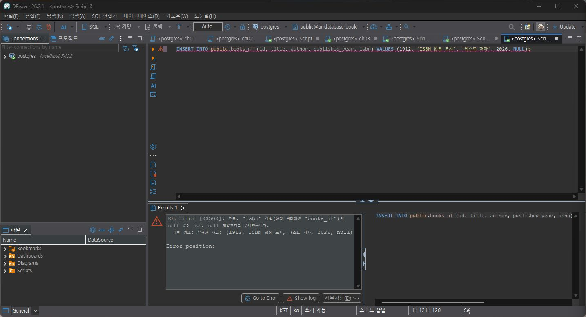
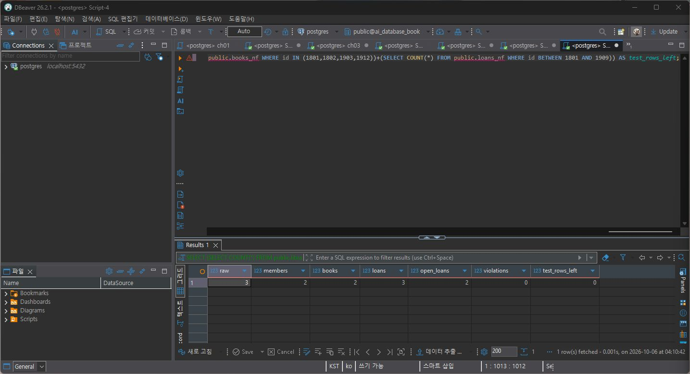
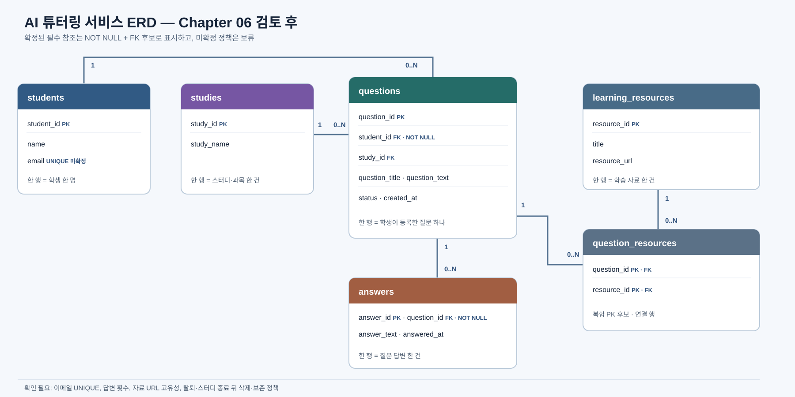

# Chapter 06 확장 실습 답안

> 과제: 정규화와 데이터 무결성으로 좋은 테이블 만들기

```text
GitHub 계정 또는 별칭: pang789789
과제 작성일: 2026-10-06
사용한 AI 도구: ChatGPT (Codex) — SQL 결과 확인과 설계 검토에 도움
```

---

# 1. 실습 환경과 시작 상태 확인

| 확인 항목 | 실제 결과 | 의미 |
| --- | --- | --- |
| `current_database()` | `ai_database_book` | 실습용 DB에 연결했다. |
| `current_user` | `postgres` | 연결 계정 확인 |
| `current_schema()` | `public` | 실습 대상 스키마 |
| `search_path` | `public, "User"` | `public`이 먼저 검색된다. |
| `transaction_read_only` | `off` | 변경 가능한 연결 |

- ✓ 현재 DB와 변경 가능한 연결을 확인했다.
- ✓ DBeaver 툴바에서 Auto-commit을 확인했다. 경계값 입력은 명시적 트랜잭션으로 실행하고 `ROLLBACK`했다.
- ✓ `code/chapter06/01`부터 `05`까지 번호형 SQL 파일을 순서에 맞게 사용했다.
- ✓ 처음에는 Chapter 06 테이블 네 개가 없었다. 기존 Chapter 05 테이블은 건드리지 않고 별도 Chapter 06 테이블을 만들었다.

# 2. 정규화 전 큰 테이블의 문제 찾기

## 2-1. 위험한 중복과 의미 있는 반복 구분

| 반복되는 값/상황 | 구분 | 판단 이유 |
| --- | --- | --- |
| 회원 이메일이 여러 대여 행에 반복 | 위험한 중복 | 이메일은 회원의 현재 사실이다. 원시 대여 행마다 복사하면 변경 때 여러 행을 고쳐야 한다. |
| 도서 제목이 여러 대여 행에 반복 | 위험한 중복 | 제목은 도서 사실이다. 제목 수정 시 대여 행마다 값이 달라질 수 있다. |
| `loans_nf.member_id = 101` 반복 | 의미 있는 반복 | 회원 101이 대여를 여러 번 한 관계를 나타낸다. ID 반복만 보고 대여 행을 합치면 사건 이력이 사라진다. |
| 사건 당시 가격 같은 이력값 반복 | 경우에 따라 의미 있는 반복 | 이번 스키마에는 가격 열이 없다. 실제로 사건 당시 값을 보존해야 하는 요구가 있다면 현재 가격과 별도 이력으로 구분할 필요가 있다. |

## 2-2. 이상 현상 설명

### 삽입 이상

대여 기록이 없어도 등록할 새 도서가 원시 대여 테이블에만 저장된다면, 대여 행을 임의로 만들지 않고서는 도서 정보를 넣기 어렵다. 도서와 대여 사건을 나누면 해결된다.

### 수정 이상

회원 이메일을 원시 테이블의 여러 대여 행에 복사해 두면 모든 행을 함께 수정해야 한다. 한 행을 놓치면 같은 회원에게 서로 다른 이메일이 보인다. 회원 이메일을 회원 테이블 한 곳에서 관리하면 수정 위치가 하나다.

### 삭제 이상

마지막 대여 행을 지우면서 그 행에만 있던 도서 제목이나 회원 이메일까지 잃을 수 있다. 도서·회원 정보를 대여 사건과 분리하면 사건 삭제가 현재 엔터티 정보 삭제로 이어지지 않는다.

### 왜 이것이 SQL 문법 문제가 아니라 구조 문제인가요?

SQL 문법이 맞아도 한 테이블에 서로 다른 사실을 섞어 두면 같은 사실을 여러 행에서 고쳐야 하거나, 행을 지울 때 다른 사실까지 사라질 수 있다. 저장할 사실과 각 사실의 주인을 먼저 나눠야 한다.

# 3. 1NF·2NF·3NF 핵심 질문 복습

## 3-1. 제1정규형(1NF)

한 셀에 여러 책을 쉼표로 넣거나 `book1`, `book2`, `book3` 열을 만들면 책을 하나씩 검색·수정하기 어렵고 책 개수가 늘 때마다 구조까지 바꿔야 한다. 책 한 건이나 연결 한 건을 한 행으로 저장한다.

내 AI 튜터링 서비스에서는 질문에 연결한 자료들을 한 셀에 URL 목록으로 저장하지 않고 `question_resources`에서 질문과 자료 연결을 한 행씩 관리한다.

## 3-2. 제2정규형(2NF)

`(student_id, course_id)`가 수강 행의 복합키라면 `grade`는 두 값의 조합에 해당하지만, `student_name`은 `student_id`만으로 알 수 있고 `course_name`은 `course_id`만으로 알 수 있다. 이런 열을 수강 행에 같이 두면 학생명이나 과목명이 여러 수강 행에 복사된다. 학생·과목 사실을 각각의 테이블에 두고 수강 행에는 관계와 성적을 둔다. 단일 열 PK만 쓰는 테이블에는 복합키 일부 종속 문제가 그대로 적용되지 않는다.

## 3-3. 제3정규형(3NF)

회원 ID가 우편번호를 정하고, 우편번호가 도시를 정하는 규칙이 실제로 있다면 회원 행의 일반 열인 우편번호를 거쳐 도시를 반복 저장하지 않도록 검토한다. 다만 실제 업무에서 그 결정 관계가 성립하는지 먼저 확인해야 한다.

### 정규화는 값이 반복되기만 하면 무조건 분리하는 것인가요?

아니다. 반복이 여러 사건을 나타내는 관계인지, 과거 시점의 사실을 보존하는 값인지 먼저 본다. 사실의 주인과 변경 이유가 다른데 한 곳에 복사되는 경우를 분리 대상으로 본다.

# 4. 각 열의 '사실의 주인' 찾기

| 열 | 설명하는 사실 | 주인 테이블 | 이유 |
| --- | --- | --- | --- |
| `member_name` | 회원 이름 | `members_nf` | 회원의 현재 정보 |
| `member_email` | 회원 이메일 | `members_nf` | 대여 사건이 아니라 회원 정보 |
| `book_title` | 도서 제목 | `books_nf` | 도서 정보 |
| `author` | 이 실습에서 관리하는 도서 저자 문자열 | `books_nf` | 도서와 함께 관리한다. 공동 저자 관리는 별도 요구가 필요하다. |
| `borrowed_at` | 대여 시작일 | `loans_nf` | 각 대여 사건의 날짜 |
| `due_at` | 반납 예정일 | `loans_nf` | 각 대여 사건에 속하는 날짜 |
| `returned_at` | 실제 반납일 또는 미반납 상태 | `loans_nf` | 사건의 완료 시점이며 아직 미반납이면 NULL이다. |
| `member_id` | 대여한 회원 참조 | `loans_nf` | 대여 사건이 어느 회원과 연결되는지 나타낸다. |
| `book_id` | 대여된 도서 참조 | `loans_nf` | 대여 사건이 어느 도서와 연결되는지 나타낸다. |

```text
members_nf 한 행 = 회원 한 명
books_nf 한 행 = 대여 대상으로 관리하는 도서 항목 한 건
loans_nf 한 행 = 회원 한 명이 도서 한 건을 대여한 사건 한 건
```

현재 회원 이름이나 이메일과 대여일·반납일을 구분했다. 과거 대여 사건을 보존해야 한다면 사건 당시 사실을 별도로 설계해야 하며, 현재 테이블에 없는 이력을 있다고 가정하지 않는다.

# 5. PostgreSQL로 정규화 전·후 구조 재현

실행 파일은 `01_normalization_schema.sql`, `02_normalization_seed.sql`, `03_normalization_compare.sql` 순서로 DBeaver에서 실행했다.

## 5-1. 스키마 생성

실행 전 예상 테이블은 4개, 행 수는 모두 0건이었다. 실제 생성된 테이블은 `library_records_raw`, `members_nf`, `books_nf`, `loans_nf` 네 개다.

## 5-2. 기준 데이터 입력

| 항목 | 실행 후 |
| --- | ---: |
| raw | 3 |
| members | 2 |
| books | 2 |
| loans | 3 |
| 미반납 | 2 |
| 회원 101의 대여 | 2 |
| 도서 201의 대여 | 2 |

예상 기준과 일치했다.

## 5-3. 정규화 비교

```text
검증 메시지: Chapter 06 normalization comparison passed
결과: PASS
회원 고아 참조: 0
도서 고아 참조: 0
날짜 순서 오류: 0
활성 대여 중복: 0
```

테이블을 나눠도 각 대여 행에 회원 ID와 도서 ID가 있으므로 JOIN으로 회원·도서 정보를 다시 연결할 수 있다. 비교 스크립트의 결과 메시지와 실행 후 대여 결과를 아래에 붙였다.



# 6. Chapter 06에서 확정한 C-01~C-08 정책 해석

| ID | 규칙과 구현 | 필요한 이유 | Chapter 05에서 미확정이었던 이유 |
| --- | --- | --- | --- |
| C-01 | 이메일 중복 금지 — `UNIQUE` | 회원 이메일이 같은 문자열로 중복 등록되는 것을 막는다. | 이메일이 고유해야 한다는 업무 규칙이 아직 정해지지 않았다. |
| C-02 | ISBN 필수·중복 금지 — `NOT NULL + UNIQUE` | 이 실습에서 확정한 도서 식별 규칙을 지킨다. | Chapter 05 요구사항은 ISBN 저장만 언급해 없음 허용 여부가 미정이었다. |
| C-03 | 회원 이름·도서 제목 공백 금지 — `CHECK` | 공백만 있는 문자열을 유효한 이름·제목으로 저장하지 않는다. | 어떤 값이 허용되는지 구체적인 최소 규칙이 미정이었다. |
| C-04 | `due_at >= borrowed_at` — `CHECK` | 대여 시작보다 앞선 반납 예정일을 막는다. | 날짜 관계를 DB에서 강제할지 확정되지 않았다. |
| C-05 | `returned_at IS NULL OR returned_at >= borrowed_at` — `CHECK` | 미반납 NULL은 허용하고 대여 시작보다 이른 반납일은 막는다. | 실제 반납일의 허용 범위가 미정이었다. |
| C-06 | 존재하는 회원·도서만 참조 — `FOREIGN KEY` | 존재하지 않는 부모 ID로 대여 사건을 만들지 못하게 한다. | 참조 관계와 삭제 동작을 DB에 어떻게 둘지 확정 전이었다. |
| C-07 | 대여 이력이 있는 부모 삭제 제한 — `ON DELETE RESTRICT` | 참조 중인 회원·도서를 이력과 함께 실수로 지우지 않게 한다. | 이력 보존과 삭제 정책을 먼저 결정해야 했다. |
| C-08 | 도서당 미반납 대여 최대 한 건 — 부분 고유 인덱스 | 이미 미반납 행이 있는 도서에 두 번째 활성 대여를 막는다. | 같은 책을 동시에 빌릴 수 있는지와 실물 복본을 어떻게 볼지 미정이었다. |

아직 정하지 않은 정책을 먼저 제약조건으로 만들면 정상 데이터를 막거나 보존할 이력을 지울 수 있다. 실습의 C-01~C-08은 이 과제에서 확정한 규칙으로 테스트했다.

# 7. 기존 데이터 검사 후 무결성 규칙 적용

기존 행이 새 규칙을 위반하고 있다면 `ALTER TABLE` 적용이 실패하거나 데이터를 고치는 업무 판단이 필요할 수 있다. 그래서 스크립트는 현재 데이터의 중복·날짜·참조 상태를 검사하고 제약조건을 적용한다.

`04_add_integrity_rules.sql`을 실행했고, 트랜잭션 커밋 뒤 메타데이터를 다시 조회했다.

```text
명명된 제약조건: 8개
지정한 NOT NULL 열: 10개
부분 고유 인덱스 uq_loans_nf_active_book: 존재
COMMIT: 스크립트의 사후 검증 통과
```

메타데이터를 조회하면 SQL이 성공했다는 출력뿐 아니라 실제 제약조건 수와 인덱스가 DB에 등록됐는지 확인할 수 있다.



# 8. 정상·경계·실패 테스트

공식 `05_integrity_tests.sql`로 기준 상태를 확인했다. 경계값은 명시적 트랜잭션에서 실행하고 되돌렸다. 실패값은 SQL 한 건씩 DBeaver에서 실행했다.

## 8-1. 허용 경계값

| 테스트 | 예상 | 실제 | 허용 근거 |
| --- | --- | --- | --- |
| `due_at = borrowed_at` | 성공 | 성공 후 롤백 | 규칙은 대여일과 같거나 이후를 허용한다. |
| `returned_at = borrowed_at` | 성공 | 성공 후 롤백 | 실제 반납일이 대여일과 같아도 CHECK를 만족한다. |
| `published_year = NULL` | 성공 | 성공 후 롤백 | 출판연도는 이 규칙에서 필수 열로 지정하지 않았다. |
| 공백이 아닌 한 글자 이름 | 성공 | 성공 후 롤백 | 공백 이름만 금지하며 글자 수 최소 규칙은 두지 않았다. |
| `returned_at = NULL` | 성공 | 기존 기준 데이터에서 확인 | 미반납을 NULL로 나타낸다. |

경계값 입력은 모두 트랜잭션에서 되돌려 기준 테이블에 테스트 행이 남지 않도록 했다.

## 8-2. 실패해야 하는 값

각 행은 따로 실행했다. 오류 코드는 화면에서 확인한 PostgreSQL 오류 종류를 기준으로 적었다.

| 테스트 | 규칙 | 실제 결과와 오류 핵심 |
| --- | --- | --- |
| 회원 이름 NULL | `NOT NULL` | 실패, `23502` — `name`에 NULL 입력 불가 |
| ISBN NULL | `NOT NULL` | 실패, `23502` — `isbn`에 NULL 입력 불가 |
| 이메일 중복 | `UNIQUE` | 실패, `23505` — 중복 이메일 키 |
| ISBN 중복 | `UNIQUE` | 실패, `23505` — 중복 ISBN 키 |
| 공백 이름 | `CHECK` | 실패, `23514` — 이름 공백 검사 |
| 없는 회원 ID 참조 | `FOREIGN KEY` | 실패, `23503` — 참조 회원 없음 |
| `due_at < borrowed_at` | `CHECK` | 실패, `23514` — 반납 예정일 순서 위반 |
| `returned_at < borrowed_at` | `CHECK` | 실패, `23514` — 실제 반납일 순서 위반 |
| 같은 도서에 두 번째 미반납 대여 | 부분 고유 인덱스 | 실패, `23505` — 활성 대여 중복 |

대표 오류 화면에는 ISBN 필수 제약 위반이 표시된다. 의도한 오류 뒤 데이터를 다시 조회했다.



## 8-3. 실패 테스트 후 기준 상태

| 확인 | 최종 결과 |
| --- | ---: |
| raw | 3 |
| members | 2 |
| books | 2 |
| loans | 3 |
| 미반납 | 2 |
| 고아 참조·날짜 오류·활성 대여 중복 합계 | 0 |
| 테스트 행 잔존 | 0 |

실패 입력이 거부되어도 기존 정상 행이 남아 있어야 무결성 규칙이 기대대로 동작한 것이다. 최종 조회 결과를 첨부했다.



참조 중 부모 삭제 테스트는 실제로 실행하지 않았다. 원본 스크립트의 FK가 `ON DELETE RESTRICT`로 정의된 것과 메타데이터 적용은 확인했지만, 과제 데이터의 회원·도서 삭제를 시도하지는 않았다.

# 9. 정규화와 무결성 제약조건 역할 비교

| 질문 | 정리 |
| --- | --- |
| 정규화 | 사실의 주인과 테이블 경계를 나눠 같은 현재 사실이 여기저기 복사되는 문제를 줄인다. |
| `NOT NULL` | 값이 꼭 있어야 하는 열이 비어 있는 입력을 막는다. |
| `UNIQUE` | 확정된 고유성 규칙에 어긋나는 중복을 막는다. |
| `CHECK` | 한 행 안에서 값의 조건과 날짜 순서를 확인한다. |
| `FOREIGN KEY` | 참조 대상이 없는 관계를 막는다. |
| 부분 고유 인덱스 | `returned_at IS NULL`인 대여에 한해 도서별 중복을 막는다. |

정규화만으로는 필수값 누락이나 이메일 중복 같은 입력 오류를 모두 막지 못한다. 반대로 제약조건을 많이 넣어도 서로 다른 사실을 한 테이블에 섞은 구조가 저절로 좋아지지 않는다. FK는 참조 대상의 존재를 보장하지만 그 회원이 실제 업무상 대여 자격이 있는지까지 판단하지는 않는다.

# 10. Chapter 05 개인 ERD 개선

기존 AI 튜터링 질문 관리 모델의 엔터티 구분은 유지했다. 이번 검토에서 확정된 필수 관계를 ERD에 표시하고, 근거가 부족한 고유성·삭제 정책은 보류했다. 기존 표 구조를 데이터베이스에 새로 생성한 것은 아니며, 그림과 정책 후보를 검토한 결과다.

## 10-1. 수정 전·후 비교

| 항목 | 수정 전 | 수정 후 | 변경 근거 | 요구사항 |
| --- | --- | --- | --- | --- |
| 질문 작성자 | `questions.student_id` FK | 필수 FK로 표시 | 질문은 작성한 학생 한 명과 연결된다. | P05-R02, R03 |
| 답변 원본 질문 | `answers.question_id` FK | 필수 FK로 표시 | 답변 한 건은 질문 한 건의 답변이다. | P05-R04, R05 |
| 질문과 자료 연결 | 두 FK 연결 | `(question_id, resource_id)` 복합 PK 후보 유지 | 같은 질문-자료 쌍의 중복 연결은 별도 의미가 없다는 모델 판단이다. | P05-R06, R07 |
| 이메일 고유성 | 미정 | `UNIQUE`를 추가하지 않고 확인 필요로 둠 | 중복 금지 근거가 아직 없다. | P05-Q01 검토 필요 |

## 10-2. 개인 프로젝트 무결성 규칙 후보

| 규칙 ID | 업무 규칙 | 제약조건 후보 | 상태 | 근거 |
| --- | --- | --- | --- | --- |
| P06-C01 | 질문은 작성 학생 한 명과 연결 | `student_id NOT NULL`, FK | 확정 후보 | P05-R02, R03 |
| P06-C02 | 답변은 대상 질문 한 건과 연결 | `question_id NOT NULL`, FK | 확정 후보 | P05-R04, R05 |
| P06-C03 | 질문-자료 연결 쌍 중복 방지 | 두 FK의 복합 PK | 설계 후보 | 질문과 자료를 연결하는 행의 의미에 근거 |
| P06-C04 | 학생 이메일 중복 금지 | `UNIQUE(email)` | 확인 필요 | P05 요구사항에 중복 금지 규칙 없음 |
| P06-C05 | 학생·질문·자료 삭제 동작 | `RESTRICT` 또는 보존 정책 | 확인 필요 | 탈퇴 및 질문·자료 이력 보존 규칙 미정 |



# 11. AI를 정규화·무결성 리뷰어로 활용

## 11-1. 검토한 구조와 규칙

```text
내 서비스: AI 튜터링 질문 관리
검토 테이블: students, studies, questions, answers, learning_resources, question_resources
한 행의 의미: 학생 한 명, 질문 한 건, 답변 한 건, 질문-자료 연결 한 건
중복 의심 열: 학생 이메일, 자료 URL, 질문 안의 자료 목록
확정 관계: 질문 작성 학생, 답변 대상 질문, 질문-자료 연결
미확정 정책: 이메일·URL 고유성, 질문당 답변 수, 삭제·보존 범위
```

## 11-2. AI에게 전달한 핵심 프롬프트

```text
이 ERD를 바로 다시 만들지 말고 각 열의 사실 주인과 관계의 의미부터 검토해 주세요. 값 반복만으로 분리를 권하지 말고, 확정된 요구사항에만 NOT NULL·UNIQUE·CHECK·FK 후보를 제안해 주세요. 이메일과 URL의 고유성, 질문당 답변 수, 삭제 정책은 미확정으로 두고 확인 질문으로 남겨 주세요. 정상·경계·실패값 테스트도 제시해 주세요.
```

## 11-3. 제안 검토

| AI 제안 | 판단 | 근거와 확인 방법 |
| --- | --- | --- |
| `questions.student_id` 필수 FK | 수용 후보 | 질문 작성 학생을 요구한다. 스키마 적용 전 NOT NULL과 FK 테스트가 필요하다. |
| `answers.question_id` 필수 FK | 수용 후보 | 답변의 대상 질문이 필요하다. 없는 질문 ID를 넣는 FK 테스트로 확인할 수 있다. |
| 학생 이메일 `UNIQUE` | 보류 | 요구사항에서 중복 금지를 찾지 못했다. 정책 확인 전 적용하지 않는다. |
| 질문 자료 연결에 복합 PK | 수용 후보 | 같은 연결 쌍을 한 번만 저장하는 모델로 검토했다. 실제 연결 요구를 확인한다. |
| 모든 FK에 `ON DELETE CASCADE` | 거절 | 질문과 답변 이력을 함께 지워도 되는 근거가 없다. 보존 정책을 먼저 정해야 한다. |

이 검토에서 이메일 고유성이나 삭제 정책을 확정 규칙으로 취급하지 않았다. ERD의 후보는 아직 PostgreSQL에서 구현·시험한 개인 서비스 스키마가 아니다.

# 12. 최종 성찰

```text
1. 정규화에서 가장 중요한 질문은 각 열의 사실을 어느 대상이나 사건이 소유하는가이다.

2. 위험한 중복은 같은 현재 사실을 고칠 곳이 여러 개인 경우이고,
   의미 있는 반복은 서로 다른 사건이나 관계를 나타내는 경우다.

3. 정규화는 사실을 어디에 둘지 정리하고, 제약조건은 확정된 규칙에 어긋난 입력을 막는다.

4. 실패 SQL을 실행하면 DB가 의도한 잘못된 값을 실제로 거부하는지 확인할 수 있다.

5. AI의 UNIQUE/CHECK/FK 제안도 업무 근거와 정상·경계값을 확인한 뒤 적용해야 한다.
```

# 13. 제출 전 확인

- ✓ 위험한 중복과 의미 있는 반복, 삽입·수정·삭제 이상을 기록했다.
- ✓ 1NF·2NF·3NF와 열의 사실 주인을 정리했다.
- ✓ 정규화 스키마·기준 데이터·비교 스크립트를 실행했다.
- ✓ C-01~C-08 적용 후 제약조건 8개, 지정 NOT NULL 열 10개, 부분 고유 인덱스를 확인했다.
- ✓ 경계값 4종을 트랜잭션으로 실행하고 되돌렸다.
- ✓ 실패 입력 9건을 각각 실행하고 기준 데이터가 유지됨을 조회했다.
- ✓ Chapter 05 ERD를 검토해 필수 참조와 미확정 정책을 구분한 그림을 첨부했다.
- ✓ 화면 캡처 3장과 ERD 1장을 이 문서에 삽입했다. DBeaver 캡처에는 원격 포인터 표시가 없다.
- 완료 전: GitHub Markdown 웹 화면에서 확인하고 commit/push해야 공개 URL이 생긴다.
- LMS 제출은 아직 하지 않았다. 저장소 업로드 후 이 파일의 GitHub 웹 URL을 기입한다.

# 14. LMS 제출 URL

```text
제출 URL: GitHub 업로드 후 기입
```

> 현재 답안과 이미지는 로컬 저장소의 Chapter 06 폴더에 있다. 원격 저장소에 push하지 않았으므로 제출 URL은 아직 없다.
