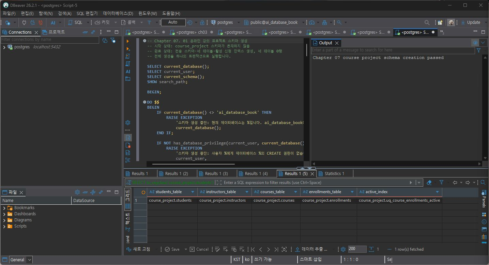
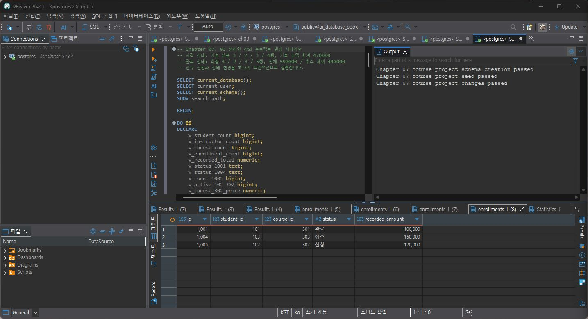
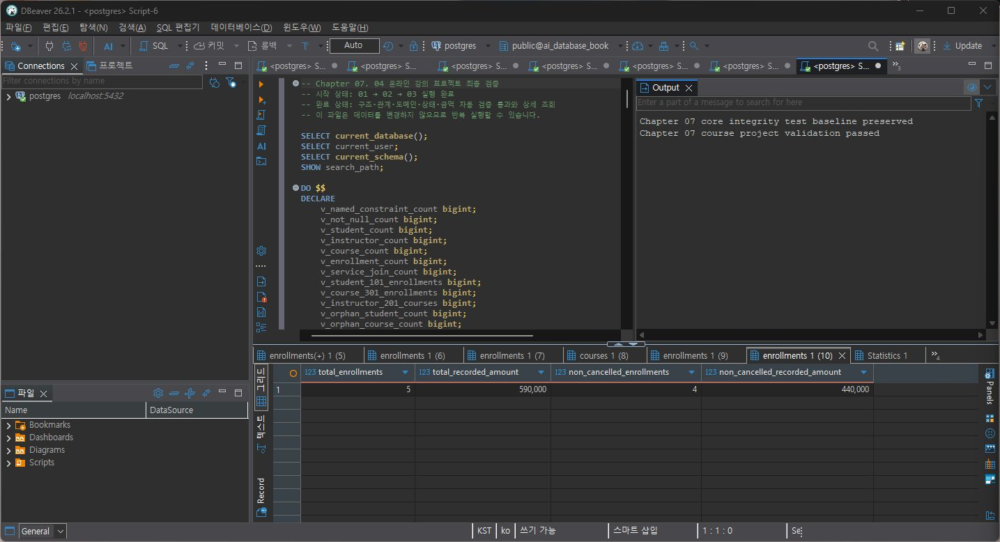
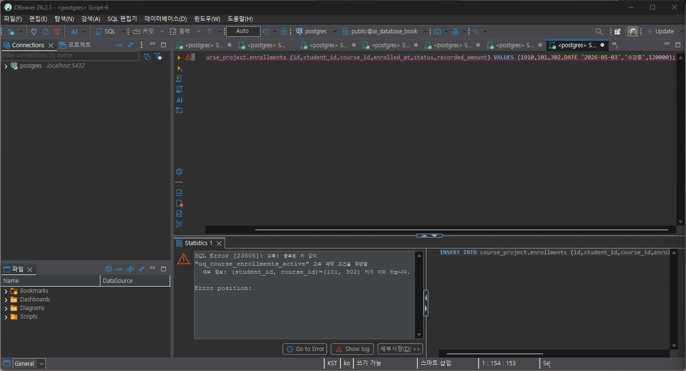
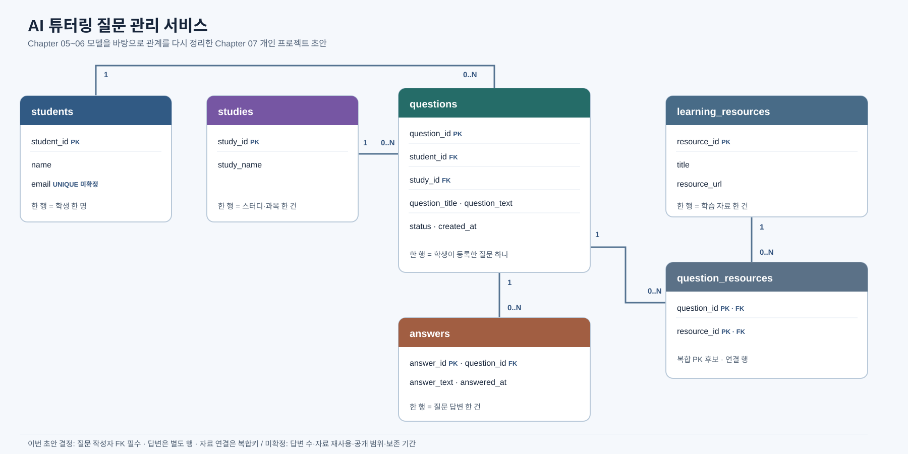

# Chapter 07 확장 실습 답안

| 항목 | 기록 |
| --- | --- |
| GitHub 별칭 | pang789789 |
| 작성일 | 2026-10-06 |
| AI 도구 | ChatGPT / Codex (검토와 정리 보조) |

> DBeaver SQL 실행 결과를 기준으로 작성했다. 비밀번호나 접속 URL은 답안과 캡처에 포함하지 않았다.

## 1. 시작 환경 확인

| 확인 항목 | 실제 결과 | 의미 |
| --- | --- | --- |
| current_database() | ai_database_book | 과제 DB |
| current_user | postgres | 접속 계정 |
| current_schema() | public | 기본 스키마 |
| search_path | "$user", public | 객체 탐색 경로 |
| transaction_read_only | off | 쓰기 가능한 연결 |

실행 전 데이터베이스, 계정, 읽기 전용 여부, 대상 스키마의 존재 여부를 확인했다. DBeaver Auto-commit 표시도 확인하고 스크립트가 직접 트랜잭션을 관리하는지 살펴본 뒤 실행했다. 이 확인으로 다른 DB에 객체를 만들거나 기존 데이터를 덮어쓰는 실수를 줄일 수 있다.

## 2. 범위와 요구사항

### 2-1. 포함 범위

1. 학생과 강사의 기본 정보를 저장한다.
2. 강의의 담당 강사, 설명, 난이도, 현재 가격과 개설일을 저장한다.
3. 학생의 강의 신청을 별도 행으로 기록한다.
4. 신청 상태와 신청 당시 기록 금액으로 변경 시나리오를 확인한다.

### 2-2. 제외 범위

1. 카드 승인, 실제 결제, 환불 처리는 다루지 않는다.
2. 정산·회계 매출이나 강사 급여는 계산하지 않는다.
3. 강의 영상, 수강 진도, 알림 발송은 다루지 않는다.
4. 할인 쿠폰과 대기자 명단은 이번 스키마 범위 밖이다.

범위를 먼저 정하면 각 테이블이 저장할 사실을 구분할 수 있고, 아직 확인되지 않은 업무 정책을 제약조건으로 단정하지 않게 된다.

### 2-3. 요구사항 / 결정 / 미확정 질문

| ID | 종류 | 내용 요약 | DB 영향 |
| --- | --- | --- | --- |
| P07-R01 | 요구사항 | 학생 정보를 저장한다. | students와 필수 기본 열 |
| P07-R05 | 요구사항 | 학생의 강의 신청을 기록한다. | enrollments가 학생·강의를 참조 |
| P07-R07 | 요구사항 | 학생/강사 각각의 이메일 중복을 막는다. | 각 테이블의 UNIQUE |
| P07-D02 | 결정 | 난이도는 basic/intermediate/advanced로 제한한다. | courses.level CHECK |
| P07-D03 | 결정 | 같은 학생·강의 쌍의 활성 신청 중복을 금지한다. | 조건부 고유 인덱스 |
| P07-Q01 | 미확정 | 기록 금액이 결제 승인액인지, 할인 전후 어느 금액인지 확인이 필요하다. | 회계 의미를 이 필드에 덧붙이지 않음 |

미확정 정책을 바로 제약조건으로 만들면 확인되지 않은 업무 규칙을 DB에 고정하게 된다. 담당자 확인 전에는 질문으로 남긴다.

## 3. 네 테이블의 한 행 의미와 관계

- students 한 행은 학생 한 명이다.
- instructors 한 행은 강사 한 명이다.
- courses 한 행은 현재 제공하는 강의 한 개다.
- enrollments 한 행은 학생의 특정 강의 신청 사건 한 건이다.

| 테이블 | PK | FK | 중요 규칙 |
| --- | --- | --- | --- |
| students | id | 없음 | 이름·이메일·가입일 필수, 이메일 UNIQUE |
| instructors | id | 없음 | 이름·이메일·전문 분야 필수, 이메일 UNIQUE |
| courses | id | instructor_id → instructors.id | 담당 강사 필수, 난이도 제한, 가격 0 이상 |
| enrollments | id | student_id → students.id, course_id → courses.id | 상태 제한, 기록 금액 0 이상, 활성 중복 금지 |

강사 한 명은 강의를 0개 이상 맡고, 각 강의에는 강사 한 명이 지정된다. 학생 한 명은 신청을 0개 이상 만들며 신청 한 건은 학생 한 명에 속한다. 강의 하나에는 신청이 0개 이상 연결되고 신청은 강의 하나를 가리킨다.

학생과 강의의 N:M 관계는 enrollments를 통해 두 개의 1:N 관계로 나뉜다. 신청일·상태·기록 금액을 보관하므로 단순 연결 테이블이 아니라 변경 가능한 신청 사건을 기록한다.

## 4. recorded_amount의 의미

- courses.price: 강의 테이블에 저장된 현재 가격
- enrollments.recorded_amount: 신청 행에 보관된 신청 당시 기록 금액

강의 가격은 나중에 바뀔 수 있어도 과거 신청의 기록 금액은 유지할 수 있다. 처음 숫자가 같더라도 의미와 변경 시점은 다르다. 결제 승인·환불 자료는 없으므로 이를 결제 성공액이나 회계 매출이라고 부르지 않는다.

## 5. STEP 01 — 스키마와 테이블 생성

실행 파일: code/chapter07/01_course_project_schema.sql

| 항목 | 예상 | 실제 |
| --- | --- | --- |
| course_project | 없음 | 새로 생성 |
| 테이블 | 4 | 4 |
| 명명 제약조건 | 15 | 15 |
| NOT NULL 열 | 20 | 20 |
| 부분 고유 인덱스 | 1 | uq_course_enrollments_active |
| 네 테이블 행 | 모두 0 | 모두 0 |
| 통과 메시지 | schema creation passed | Chapter 07 course project schema creation passed |

예상과 실제가 일치했다.

## 6. STEP 02 — Seed 데이터

실행 파일: code/chapter07/02_course_project_seed.sql

예상 및 실제 행 수는 students/instructors/courses/enrollments 순서로 3 / 2 / 3 / 4, 기록 금액 합계 470,000원이었다. 학생 101의 신청 2건, 강의 301의 신청 2건, 강사 201의 담당 강의 2개, 활성 중복 0건을 확인했다. 1001은 수강중, 1004는 신청, 1005는 아직 없었다. Seed 통과 메시지도 확인했다. 서로 다른 관계와 상태를 두어 FK, 건수, 집계, 변경 시나리오를 확인할 수 있는 검증 데이터다.

## 7. STEP 03 — 변경 시나리오

실행 파일: code/chapter07/03_course_project_changes.sql

| 신청 ID | 변경 전 | 변경 후 | 기록 금액 |
| ---: | --- | --- | ---: |
| 1001 | 수강중 | 완료 | 100,000원 |
| 1004 | 신청 | 취소 | 150,000원 |
| 1005 | 없음 | 신청 | 120,000원 |

실제 신청은 5건, 전체 합계 590,000원, 취소 제외 4건과 440,000원이었다. 활성 중복은 0건이고 변경 스크립트가 PASS했다. 조건부 UPDATE는 예상한 이전 상태인 행만 바꾸므로 엉뚱한 상태의 자료를 잘못 수정할 가능성을 줄인다.

## 8. STEP 04 — 최종 완료 게이트

실행 파일: code/chapter07/04_course_project_validation.sql

최종 행 수는 3 / 2 / 3 / 5였다. 서비스 JOIN 5행, 학생 101 신청 2건, 강의 301 신청 2건, 강사 201 강의 2개, 고아 관계 0건, 활성 중복 0건을 확인했다. 전체 기록 금액 590,000원, 취소 제외 440,000원이며 Chapter 07 course project validation passed가 출력됐다.

SQL 파일이 오류 없이 끝난 것과 검증 PASS는 다르다. 완료 게이트는 행 수·관계·상태·합계가 기대값과 맞는지 다시 계산한다.

## 9. 무결성 테스트

실행 파일: code/chapter07/05_course_project_integrity_tests.sql의 테스트 구간과 개별 문장을 사용했다.

### 9-1. 허용 경계값

가격 0원, 설명 NULL인 강의와 기록 금액 0원인 신청을 트랜잭션 안에 넣었다. 오류 없이 허용되어 기대와 맞았고 ROLLBACK했다. 규칙이 가격과 금액 0 이상이므로 0은 허용 경계값이다.

### 9-2. 실패 테스트 1 — 잘못된 값

난이도 expert를 입력했다. SQLSTATE 23514 CHECK 위반으로 거부됐으며 chk_course_courses_level이 동작했다. 허용 난이도 밖의 값이 저장되면 분류와 집계가 일관되지 않는다.

### 9-3. 실패 테스트 2 — 활성 중복 신청

이미 활성 신청이 있는 학생 101의 강의 302에 수강중 행을 추가하려 했다. SQLSTATE 23505로 거부됐으며 부분 고유 인덱스 uq_course_enrollments_active가 동작했다.

### 9-4. 실패 후 기준 상태

실패 입력은 각각 별도 문장으로 거부되었고, 경계값 테스트는 롤백했다. 이어 04 validation을 다시 실행해 PASS와 기준 행 수/금액(5건/590,000원, 취소 제외 4건/440,000원)을 확인했다. 실패 테스트는 잘못된 입력 차단을 확인하고, 재검증은 기준 자료가 유지됐는지 확인한다.

## 10. 재현성 실험

초기화 SQL은 course_project 스키마와 프로젝트 테이블을 삭제한다. 지금 만든 결과를 보존하기 위해 reset_course_project.sql은 실행하지 않았고 처음부터 재실행하는 실험도 하지 않았다. 대신 삭제 없는 validation을 다시 실행해 PASS와 기준 건수·합계 유지를 확인했다. 따라서 전체 재현성 실험을 완료했다고 기록하지 않는다. 빈 별도 DB에서 reset → 01 → 02 → 03 → 04 순서로 같은 결과가 나와야 전체 재현을 확인할 수 있다.

## 11. 개인 프로젝트 초안: AI 튜터링 질문 관리 서비스

문제: 학생 질문, 답변, 참고 자료를 연결하고 질문 이력을 찾기 쉽게 기록한다. 주요 사용자는 질문을 올리는 학생과 답변하는 튜터다.

포함: 학생·스터디, 질문과 작성자, 답변 이력, 자료와 질문 간 연결. 제외: AI 답변 생성, 실시간 채팅, 로그인·결제, 알림, 권한별 비공개 정책 구현.

| ID | 요구사항 | 관련 테이블 | 검증 후보 |
| --- | --- | --- | --- |
| P07-MR01 | 학생 정보를 보관한다. | students | 필수 값 확인 |
| P07-MR02 | 스터디/과목을 보관한다. | studies | 행 수와 이름 |
| P07-MR03 | 질문은 작성 학생을 참조한다. | questions | FK·고아 0건 |
| P07-MR04 | 제목·본문·상태·시각을 저장한다. | questions | 필수 열·상태 |
| P07-MR05 | 답변을 질문과 분리한다. | answers | FK·질문별 조회 |
| P07-MR06 | 학습 자료를 보관한다. | learning_resources | 필수 열 |
| P07-MR07 | 질문과 자료 연결을 저장한다. | question_resources | 중복 쌍 검사 |
| P07-MR08 | 질문에서 답변·자료까지 조회한다. | 전체 관계 | 대표 JOIN |

| ID | 프로젝트 결정 | 이유 | 구현 후보 |
| --- | --- | --- | --- |
| P07-MD01 | 질문 한 건에 작성 학생 한 명 | 책임자 구분 | 필수 FK |
| P07-MD02 | 답변은 질문에 덮어쓰지 않고 별도 행 | 답변 이력 보존 | answers 테이블 |
| P07-MD03 | 질문-자료 한 쌍을 고유하게 취급 | 중복 연결 방지 | 복합 PK 후보 |

미확정 질문:

- P07-MQ01. 질문 하나에 답변을 여러 개 허용할까, 수정 이력으로 볼까?
- P07-MQ02. 같은 자료를 여러 질문에서 재사용할 수 있을까?
- P07-MQ03. 공개 범위와 탈퇴·스터디 종료 후 보존 기간은 어떻게 정할까?

## 12. 개인 프로젝트 ERD와 한 행 의미

| 테이블 | 한 행 의미 | PK 후보 | FK 후보 | 규칙 후보 |
| --- | --- | --- | --- | --- |
| students | 학생 한 명 | student_id | 없음 | 이메일 UNIQUE 여부 미확정 |
| studies | 스터디·과목 하나 | study_id | 없음 | 이름 필수 |
| questions | 질문 하나 | question_id | student_id, 선택적 study_id | 작성자 참조 |
| answers | 답변 하나 | answer_id | question_id | 별도 이력 행 |
| learning_resources | 자료 하나 | resource_id | 없음 | 제목·URL |
| question_resources | 질문-자료 연결 하나 | 두 ID 복합 후보 | 두 ID | 쌍 중복 방지 |

관계: students 1:N questions, studies 1:N questions(스터디를 지정하는 경우), questions 1:N answers, questions와 learning_resources는 question_resources를 통한 N:M이다.

Chapter 05~06 모델에서 질문 작성자 FK와 연결 테이블 복합키 후보를 분명히 적었다. 이메일 UNIQUE, 답변 개수, 자료 재사용, 삭제·보존 정책은 아직 미확정이다. ERD는 구현 완료 모델이 아니라 검토용 초안이다.

## 13. 개인 프로젝트 완료 기준

| # | 완료 기준 | 자동 SQL | 검증 방법 |
| ---: | --- | --- | --- |
| 1 | Seed 뒤 테이블별 행 수가 예상과 일치한다. | 가능 | COUNT |
| 2 | 작성 학생 없는 질문이 없다. | 가능 | FK·고아 조회 |
| 3 | 부모 질문 없는 답변이 없다. | 가능 | FK·고아 조회 |
| 4 | 질문-자료 쌍이 중복되지 않는다. | 가능 | 복합키·중복 검사 |
| 5 | 허용되지 않은 상태를 DB가 거부한다. | 가능 | CHECK 실패 테스트 |
| 6 | 질문에서 학생·답변·자료를 조회할 수 있다. | 가능 | 대표 JOIN |

## 14. AI 리뷰

전달 자료: 위 요구사항 8개, 테이블 역할, 결정 3개, 미확정 질문, 완료 기준 6개.

사용한 프롬프트:

> 요구사항과 테이블 후보의 한 행 의미, FK, N:M 연결, 완료 기준을 검토해 주세요. 누락과 검증하기 어려운 조건을 지적하고 각 제안에 근거와 확인 방법을 붙여 주세요. 미확정 정책은 임의로 정하지 말고 질문으로 남겨 주세요.

| AI 제안 | 검토 | 근거와 반영 |
| --- | --- | --- |
| 질문과 답변을 별도 테이블로 둔다. | 수용 | 답변 이력을 위해 answers와 질문 FK를 표시 |
| 학생 이메일을 반드시 UNIQUE 처리한다. | 보류 | 허용 정책 미확정이라 질문으로 남김 |
| 질문-자료 연결에 복합키 후보를 둔다. | 수용 | 같은 연결 중복 방지 후보로 표시 |
| 질문 삭제 때 답변과 자료를 CASCADE 삭제한다. | 거절 | 이력 보존·삭제 정책 미확정, 자동 삭제는 설계하지 않음 |

리뷰에서 미확정 정책을 강제로 결정하지 않도록 했다. 누락된 정책과 실제 확인 가능한 완료 기준을 점검한 것이 도움이 됐다.

## 15. 최종 성찰

1. 완료 판단에는 SQL 파일보다 실제 DB 결과가 검증 기준과 맞는지가 중요하다.
2. Seed는 화면을 채우는 것보다 관계와 집계가 맞는지 확인하기 위해 쓴다.
3. 실패 테스트는 잘못된 입력을 DB가 막는지 확인하기 위해 필요하다.
4. 요구사항과 결정은 정해진 조건과 내가 선택한 정책을 구분하기 위해 나눈다.
5. 먼저 확인할 정책은 질문 한 건에 답변을 여러 개 허용할지 여부다.

## 16. 제출 체크리스트

- ✓ 답안 파일과 실행 근거를 저장했다.
- ✓ DB 연결, 읽기/쓰기 상태와 시작 객체를 확인했다.
- ✓ 포함/제외, 요구사항/결정/질문, 테이블 관계를 정리했다.
- ✓ 01~04 SQL을 실행하고 결과를 확인했다.
- ✓ 허용 경계값, 실패 테스트 2건, 실패 후 validation을 확인했다.
- ✓ 개인 프로젝트 요구사항 8개, 결정 3개, 질문 3개를 작성했다.
- ✓ ERD 초안과 검증 가능한 완료 기준 6개를 넣었다.
- ✓ 캡처 네 장을 답안 본문에 삽입했다.
- 초기화/전체 재실행, GitHub 웹 확인, commit/push, LMS 제출은 아직 하지 않았다.

## 17. LMS 제출 URL

GitHub push 후 완성된 파일 URL을 확인해 제출한다.

초기화는 현재 만든 데이터를 지울 수 있어 실행하지 않았다. 원격 저장소 게시나 LMS 제출도 하지 않았다.
